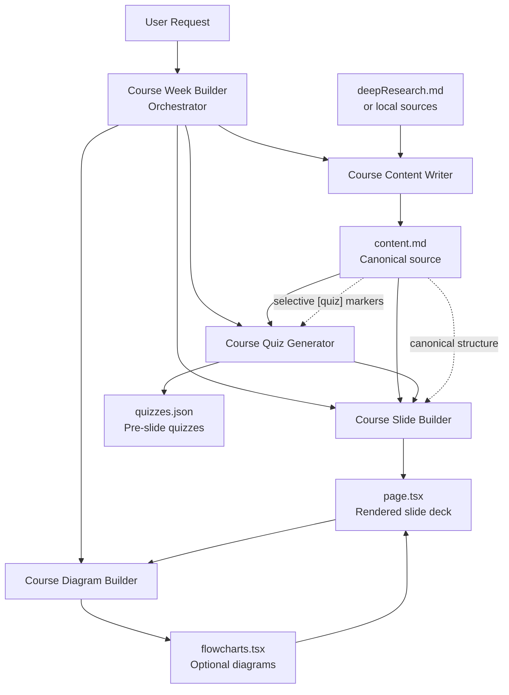

# Course Agent Workflow

This directory uses a small agent system to build and maintain each course week.

The workflow is centered on one orchestrator agent and four specialist agents.

## Agent Relationship Diagram

## Execution Order

1. `Course Week Builder` resolves the target week and decides which specialists are needed.
2. `Course Content Writer` creates or rewrites `content.md` when required.
3. `Course Quiz Generator` validates the content format and generates `quizzes.json` only for slides marked `[quiz]`.
4. `Course Slide Builder` converts `content.md` into `page.tsx` and automatically wires `quizzes.json` into slides marked `[quiz]`.
5. `Course Diagram Builder` optionally enhances `page.tsx` with diagram assets when the user asks for diagrams or the slide structure clearly supports them.

## Responsibilities

- `Course Week Builder`: orchestration, sequencing, and workflow reconciliation.
- `Course Content Writer`: lecture-note authoring and selective quiz marking.
- `Course Slide Builder`: slide rendering, `slide_id` alignment, and automatic `quizzes.json` wiring for `[quiz]` slides using `src/lib/course-quiz.ts`.
- `Course Quiz Generator`: validation-only checks and per-slide quiz generation.
- `Course Diagram Builder`: visual process diagrams and `flowcharts.tsx` wiring.

## Source Of Truth

`content.md` is the canonical authoring file.

- One `##` heading equals one slide.
- Slides marked `[quiz]` are eligible for pre-slide quiz generation.
- `page.tsx` and `quizzes.json` should stay aligned with the shared parser in `src/lib/course-content.ts` and the shared quiz helper in `src/lib/course-quiz.ts`.