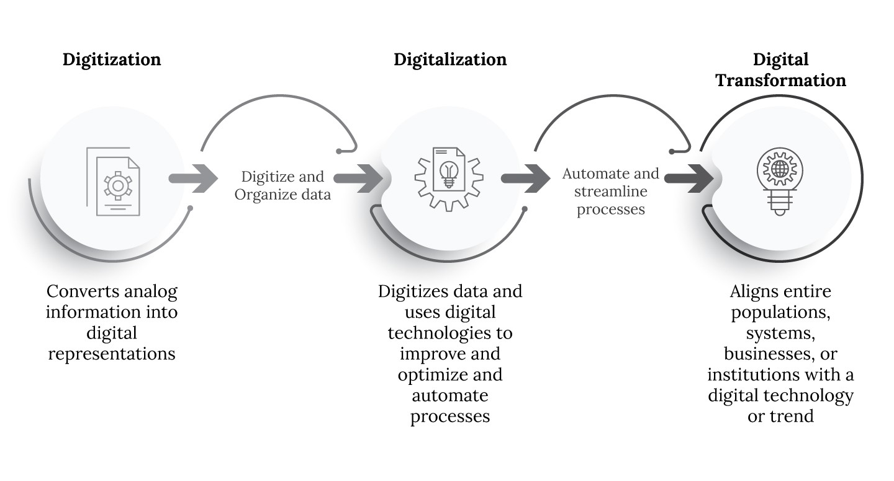
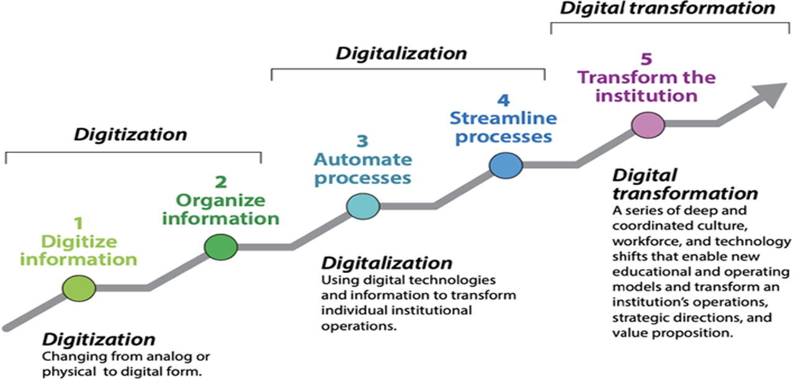
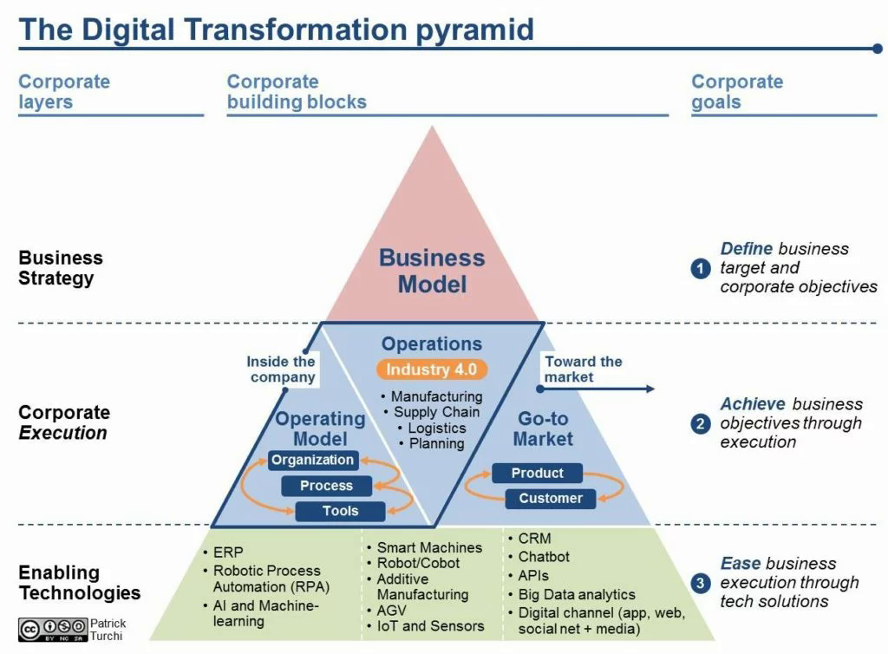

# Foundations of Digital Transformation

## Agenda

- Introduction to Digital Transformation
- Digitization, Digitalization, and Digital Transformation
- The Digital Transformation Pyramid

## Digital Transformation
- Digital transformation is the integration of digital technology into all areas of a business.  
- It fundamentally changes how businesses operate and deliver value to customers.  
- It requires a cultural shift that challenges the status quo.

## Digital Transformation

- Technology is a key enabler, but people and processes are equally important.  
- Data-driven decision-making is essential for successful transformation.  

## Key Components of Digital Transformation

1. **Technology Integration**: This involves the adoption of advanced technologies such as cloud computing, artificial intelligence (AI), big data analytics, the Internet of Things (IoT), and automation. These technologies enable organizations to streamline processes, enhance decision-making, and improve efficiency.

## Key Components of Digital Transformation

2. **Cultural Change**: Digital transformation requires a shift in organizational culture. It encourages a mindset of innovation, agility, and collaboration. Employees at all levels must be willing to embrace change, experiment with new ideas, and adapt to evolving market conditions.

## Key Components of Digital Transformation

3. **Customer-Centric Approach**: Understanding and meeting customer needs is at the heart of digital transformation. Organizations must leverage data and analytics to gain insights into customer behavior, preferences, and pain points, allowing them to deliver personalized experiences and build stronger relationships.

## Key Components of Digital Transformation

4. **Process Optimization**: Digital transformation often involves reengineering business processes to eliminate inefficiencies and enhance productivity. This can include automating routine tasks, improving supply chain management, and optimizing resource allocation.

## Key Components of Digital Transformation

5. **Data-Driven Decision Making**: Organizations must harness the power of data to inform their strategies and operations. By collecting, analyzing, and interpreting data, businesses can make informed decisions that drive growth and innovation.

## Key Components of Digital Transformation

6. **Agility and Flexibility**: In a rapidly changing digital landscape, organizations must be agile and responsive. This means being able to quickly adapt to new technologies, market trends, and customer demands.

## Discussion Question  
Which company exemplifies Digital Transformation?

## Digitization, Digitalization, and Digital Transformation

## Digitization, Digitalization, and Digital Transformation

- Digitization refers to converting analog information into digital format.  
- It involves the use of technology to improve efficiency and accuracy.  
- Digital transformation goes beyond digitization by rethinking business models and processes. 

## Digitization, Digitalization, and Digital Transformation

- It focuses on enhancing customer experiences and creating new value propositions.  
- Successful digital transformation requires a strategic vision and leadership commitment.  

## Digitization, Digitalization, and Digital Transformation

## Discussion Question

How can organizations ensure that their digitization efforts align with their overall digital transformation strategy?

## The Digital Transformation Pyramid

## The Digital Transformation Pyramid

### 1. **Foundation Layer (Technology Infrastructure)**
   - **Description**: This is the base of the pyramid and includes the essential technology infrastructure that supports digital initiatives. It encompasses hardware, software, networks, and data management systems.
   - **Key Components**: Cloud computing, data storage solutions, cybersecurity measures, and network infrastructure.

## The Digital Transformation Pyramid

### 2. **Data Layer**
   - **Description**: Above the foundation, this layer focuses on data collection, management, and analytics. Organizations need to harness data effectively to drive insights and decision-making.
   - **Key Components**: Data governance, data analytics tools, business intelligence, and data visualization.

## The Digital Transformation Pyramid

### 3. **Process Layer**
   - **Description**: This layer involves the re-engineering of business processes to leverage digital technologies. It emphasizes automation, efficiency, and agility in operations.
   - **Key Components**: Workflow automation, process optimization, and integration of digital tools into existing processes.

## The Digital Transformation Pyramid

### 4. **Customer Experience Layer**
   - **Description**: This layer focuses on enhancing the customer experience through digital channels. It involves understanding customer needs and preferences and delivering personalized experiences.
   - **Key Components**: Customer relationship management (CRM) systems, digital marketing strategies, and user experience (UX) design.

## The Digital Transformation Pyramid

### 5. **Culture and Leadership Layer**
   - **Description**: At the top of the pyramid, this layer emphasizes the importance of organizational culture and leadership in driving digital transformation. A supportive culture and visionary leadership are crucial for successful implementation.
   - **Key Components**: Change management, employee training and development, and fostering a culture of innovation and collaboration.

## The Digital Transformation Pyramid

### 6. **Innovation Layer (Optional)**
   - **Description**: Some models include an additional layer focused on innovation, which encourages organizations to continuously explore new technologies and business models.
   - **Key Components**: Research and development (R&D), experimentation, and partnerships with startups or tech companies.

## Summary

- Introduction to Digital Transformation
- Digitization, Digitalization, and Digital Transformation
- The Digital Transformation Pyramid

# Questions?