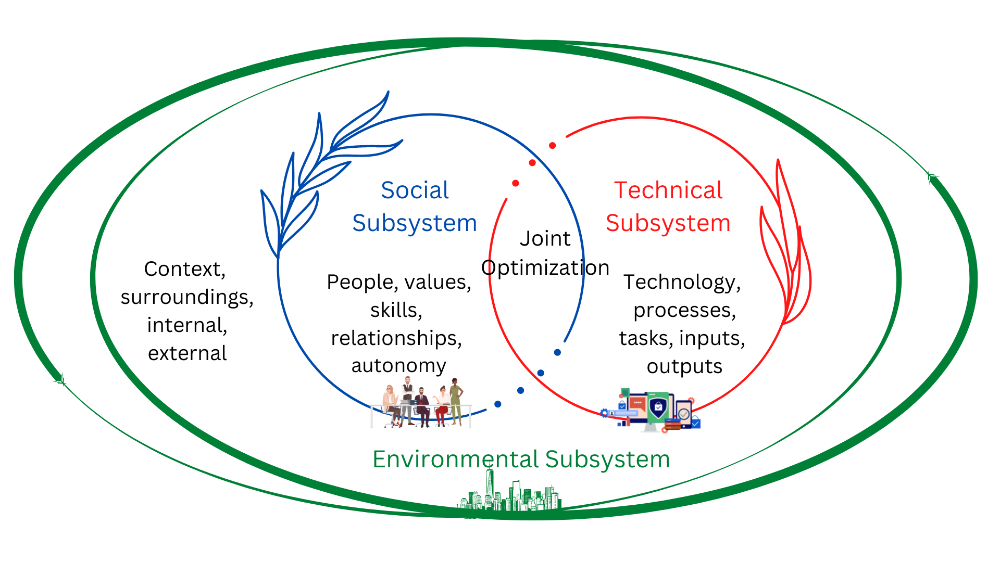

Socio-Technical Systems (STS) refer to an approach to complex organizational work design that recognizes the interaction between people (the social system) and technology (the technical system). The concept emphasizes that both social and technical elements must be considered together to optimize performance, enhance productivity, and improve overall system effectiveness.

# Components of Socio-Technical Systems

{fig-align="center"}

## **Social System**

A **social system** refers to the network of relationships, interactions, and structures that exist among individuals and groups within a society or organization. It encompasses the social dynamics, norms, values, roles, and behaviors that shape how people relate to one another and work together. Here are some key components and characteristics of a social system:

### Key Components of a Social System

1. **Individuals and Groups**: The basic building blocks of a social system are the individuals and groups (such as teams, departments, or communities) that interact with one another. Each individual brings their own experiences, skills, and perspectives.

2. **Roles and Responsibilities**: Within a social system, individuals often occupy specific roles that come with defined responsibilities. These roles can be formal (e.g., job titles) or informal (e.g., social roles within a team).

3. **Relationships**: The connections between individuals and groups are crucial. These relationships can be characterized by various factors, including trust, communication, collaboration, and power dynamics.

4. **Norms and Values**: Social systems are governed by shared norms (unwritten rules about acceptable behavior) and values (beliefs about what is important). These norms and values influence how individuals behave and interact within the system.

5. **Culture**: The collective behaviors, beliefs, and practices of a group or organization form its culture. Culture shapes the social system by influencing how members communicate, make decisions, and resolve conflicts.

6. **Communication Patterns**: The ways in which information is shared and communicated within a social system are critical. Effective communication fosters collaboration and understanding, while poor communication can lead to misunderstandings and conflict.

7. **Power Dynamics**: Social systems often involve hierarchies and power structures that affect decision-making and influence relationships. Understanding these dynamics is essential for navigating the social landscape of an organization.

### Characteristics of a Social System

- **Interdependence**: The members of a social system are interdependent, meaning that the actions of one individual or group can impact others. This interconnectedness is a key feature of social systems.

- **Adaptability**: Social systems can adapt to changes in their environment, including shifts in technology, market conditions, or social norms. This adaptability is often influenced by the relationships and communication patterns within the system.

- **Complexity**: Social systems are complex and dynamic, with multiple interacting elements. This complexity can lead to emergent behaviors that are not easily predictable based on the individual components.

- **Stability and Change**: While social systems strive for stability and cohesion, they are also subject to change. Factors such as leadership changes, organizational restructuring, or shifts in external conditions can disrupt the status quo.

### Importance of Social Systems

Understanding social systems is crucial for effective management and organizational design. By recognizing the social dynamics at play, leaders can foster a positive work environment, enhance collaboration, and improve overall performance. In the context of Socio-Technical Systems, considering the social system alongside the technical system is essential for creating effective and sustainable solutions that meet the needs of all stakeholders.

## **Technical System**

A **technical system** refers to the collection of tools, technologies, processes, and structures that are used to perform tasks and achieve objectives within an organization or a specific context. It encompasses the hardware, software, and methodologies that facilitate the work being done. Understanding the technical system is crucial for optimizing performance, improving efficiency, and ensuring that the technology aligns with the needs of the users and the organization. Here are the key components and characteristics of a technical system:

### Key Components of a Technical System

1. **Hardware**: This includes the physical devices and equipment used in the system, such as computers, servers, machinery, and other tools. Hardware is essential for executing tasks and processing information.

2. **Software**: Software encompasses the programs and applications that run on hardware. This includes operating systems, productivity software, specialized applications, and databases that support various functions within the organization.

3. **Processes**: Technical systems involve specific processes and workflows that dictate how tasks are performed. These processes can include standard operating procedures, algorithms, and methodologies that guide the use of technology.

4. **Data**: Data is a critical component of technical systems. It includes the information that is processed, stored, and analyzed by the system. Effective data management practices are essential for ensuring data quality, security, and accessibility.

5. **Networks**: Technical systems often rely on networks to facilitate communication and data exchange. This includes local area networks (LANs), wide area networks (WANs), and the internet, which enable connectivity between devices and users.

6. **User Interfaces**: The design of user interfaces (UIs) is crucial for ensuring that users can effectively interact with the technical system. Good UI design enhances usability and user experience, making it easier for individuals to perform their tasks.

7. **Support and Maintenance**: Technical systems require ongoing support and maintenance to ensure they function effectively. This includes troubleshooting, updates, and training for users to keep the system running smoothly.

### Characteristics of a Technical System

- **Interconnectedness**: The components of a technical system are often interconnected, meaning that changes in one part of the system can affect others. For example, a software update may require changes in hardware or processes.

- **Efficiency**: Technical systems are designed to improve efficiency and productivity by automating tasks, streamlining workflows, and reducing manual effort.

- **Scalability**: A well-designed technical system can scale to accommodate growth, whether that means handling more users, processing larger volumes of data, or integrating new technologies.

- **Reliability**: Reliability is a key characteristic of technical systems. They should perform consistently and accurately, minimizing downtime and errors.

- **Adaptability**: Technical systems should be adaptable to changes in technology, user needs, and organizational goals. This adaptability is essential for staying relevant in a rapidly changing environment.

### Importance of Technical Systems

Understanding technical systems is vital for organizations to leverage technology effectively. By optimizing the technical components, organizations can enhance productivity, improve decision-making, and create a competitive advantage. In the context of Socio-Technical Systems, it is essential to align the technical system with the social system to ensure that technology supports and enhances human work rather than creating barriers or inefficiencies. This alignment fosters a more integrated and effective approach to organizational design and performance.

## **Interdependence**

**Interdependence** refers to the mutual reliance and interconnectedness between different components, systems, or individuals within a larger framework. In the context of socio-technical systems, interdependence highlights how social and technical elements influence and affect each other. Understanding interdependence is crucial for effective management, design, and operation of systems, as it emphasizes that changes in one area can have significant implications for others.

### Key Aspects of Interdependence

1. **Mutual Influence**: In an interdependent system, the actions or changes in one component can directly impact others. For example, if a new technology is introduced (a change in the technical system), it may require adjustments in workflows, training, and communication practices (changes in the social system).

2. **Collaboration**: Interdependence often necessitates collaboration among individuals or groups. For instance, in a project team, members rely on each other's expertise and contributions to achieve common goals. Effective collaboration can enhance performance and innovation.

3. **Feedback Loops**: Interdependent systems often have feedback mechanisms where the output of one component serves as input for another. This feedback can help in adjusting processes, improving performance, and facilitating learning within the system.

4. **Complexity**: Interdependence contributes to the complexity of systems. The more interconnected the components, the more challenging it can be to predict outcomes or manage changes. This complexity requires careful consideration and planning.

5. **Adaptability**: Interdependent systems tend to be more adaptable to changes in their environment. When one part of the system changes, other parts can adjust in response, allowing the system to remain functional and relevant.

### Examples of Interdependence

- **In Organizations**: In a business setting, different departments (e.g., marketing, sales, production) are interdependent. Changes in marketing strategies can affect sales forecasts, which in turn may influence production schedules.

- **In Ecosystems**: In ecological systems, species are interdependent. For example, plants provide oxygen and food for animals, while animals contribute to pollination and seed dispersal, creating a balanced ecosystem.

- **In Technology**: In a software development project, the design team, development team, and quality assurance team are interdependent. The design choices made by the design team affect the development process, and the quality assurance team relies on the completed work to test and provide feedback.

### Importance of Understanding Interdependence

1. **Holistic Approach**: Recognizing interdependence encourages a holistic view of systems, prompting stakeholders to consider how changes in one area can impact others. This perspective is essential for effective decision-making and problem-solving.

2. **Improved Communication**: Understanding interdependence fosters better communication and collaboration among team members and departments, as it highlights the importance of sharing information and coordinating efforts.

3. **Change Management**: When implementing changes, awareness of interdependence helps organizations anticipate potential challenges and resistance, allowing for more effective change management strategies.

4. **Enhanced Performance**: By leveraging interdependence, organizations can optimize processes, improve efficiency, and enhance overall performance. Recognizing how different components work together can lead to innovative solutions and better outcomes.

## **Design Principles**

**Design principles** are fundamental guidelines or rules that inform the creation and development of systems, products, or processes. In the context of socio-technical systems, design principles help ensure that both the social and technical components are effectively integrated to optimize performance, enhance user experience, and achieve organizational goals. These principles serve as a framework for decision-making during the design process and can lead to more effective and sustainable solutions.

### Key Design Principles in Socio-Technical Systems

1. **User-Centered Design**: This principle emphasizes the importance of understanding the needs, preferences, and behaviors of users. Involving users in the design process through feedback, testing, and participatory design ensures that the system is tailored to their requirements, leading to higher satisfaction and usability.

2. **Holistic Approach**: A holistic perspective considers the entire system, including both social and technical elements, rather than focusing on individual components in isolation. This approach helps identify interdependencies and interactions that can impact overall system performance.

3. **Flexibility and Adaptability**: Systems should be designed to accommodate change and adapt to evolving user needs, technological advancements, and organizational goals. This principle encourages the use of modular designs and scalable solutions that can grow and evolve over time.

4. **Simplicity and Clarity**: Design should prioritize simplicity and clarity to reduce complexity and enhance usability. Clear interfaces, straightforward processes, and intuitive navigation help users understand and interact with the system more effectively.

5. **Collaboration and Communication**: Effective design should facilitate collaboration and communication among users. This can include features that support teamwork, information sharing, and feedback mechanisms, fostering a collaborative environment.

6. **Feedback Mechanisms**: Incorporating feedback loops allows users to provide input on their experiences and the system's performance. This feedback can be used to make continuous improvements and adjustments, ensuring that the system remains relevant and effective.

7. **Safety and Security**: Design should prioritize the safety and security of users and data. This includes implementing measures to protect sensitive information, ensuring compliance with regulations, and creating a safe working environment.

8. **Inclusivity and Accessibility**: Systems should be designed to be inclusive and accessible to all users, regardless of their abilities or backgrounds. This principle promotes the use of universal design practices that accommodate diverse user needs.

9. **Sustainability**: Design should consider the long-term impact on the environment and society. Sustainable design practices aim to minimize resource consumption, reduce waste, and promote social responsibility.

10. **Iterative Design Process**: The design process should be iterative, allowing for continuous refinement and improvement based on user feedback and testing. This approach encourages experimentation and learning, leading to better outcomes.

### Importance of Design Principles

- **Guidance for Decision-Making**: Design principles provide a clear framework for making design choices, helping teams stay aligned with their goals and objectives.

- **Enhanced User Experience**: By focusing on user needs and preferences, design principles lead to systems that are more intuitive, efficient, and satisfying for users.

- **Improved Collaboration**: Emphasizing collaboration and communication in design fosters a sense of community and teamwork, which can enhance overall performance.

- **Increased Efficiency**: Well-designed systems that adhere to these principles can streamline processes, reduce errors, and improve productivity.

- **Long-Term Viability**: By considering adaptability, sustainability, and inclusivity, design principles contribute to the long-term success and relevance of systems in a changing environment.

## **Participatory Design**

**Participatory Design (PD)** is an approach to design that actively involves all stakeholders, especially end-users, in the design process. The goal of participatory design is to ensure that the resulting products, services, or systems meet the actual needs and preferences of the users while also fostering a sense of ownership and empowerment among participants. This approach is particularly relevant in fields such as software development, urban planning, product design, and organizational change.

### Key Principles of Participatory Design

1. **User Involvement**: Central to participatory design is the active involvement of users throughout the design process. This can include users from various backgrounds, roles, and experiences to ensure diverse perspectives are considered.

2. **Collaboration**: Participatory design emphasizes collaboration between designers, users, and other stakeholders. This collaborative environment encourages open communication, sharing of ideas, and co-creation of solutions.

3. **Empowerment**: By involving users in the design process, participatory design empowers them to express their needs, preferences, and concerns. This empowerment can lead to greater satisfaction with the final product and a stronger commitment to its use.

4. **Iterative Process**: Participatory design is often iterative, meaning that feedback from users is continuously sought and incorporated into the design. This allows for ongoing refinement and improvement based on real-world input.

5. **Contextual Understanding**: Participatory design seeks to understand the context in which the product or system will be used. This includes considering the social, cultural, and environmental factors that may influence user experiences and needs.

6. **Diverse Methods**: Various methods and techniques can be employed in participatory design, including workshops, focus groups, interviews, prototyping, and scenario-based design. These methods facilitate engagement and encourage creative input from participants.

### Benefits of Participatory Design

1. **Better User-Centered Solutions**: By involving users in the design process, participatory design helps ensure that the final product aligns with their actual needs and preferences, leading to more effective and user-friendly solutions.

2. **Increased Acceptance and Adoption**: When users feel that their voices have been heard and their input valued, they are more likely to accept and adopt the final product or system.

3. **Enhanced Innovation**: Collaborative brainstorming and co-creation can lead to innovative ideas and solutions that may not have emerged in a traditional design process.

4. **Reduced Risk of Failure**: By identifying potential issues and user concerns early in the design process, participatory design can help mitigate risks and reduce the likelihood of costly redesigns or failures after implementation.

5. **Stronger Relationships**: Engaging users fosters stronger relationships between designers and stakeholders, creating a sense of community and shared purpose.

### Challenges of Participatory Design

1. **Time and Resource Intensive**: Involving users in the design process can be time-consuming and may require additional resources for facilitation, workshops, and feedback sessions.

2. **Diverse Perspectives**: While diversity can enhance creativity, it can also lead to conflicting opinions and challenges in reaching consensus among stakeholders.

3. **Facilitation Skills**: Effective participatory design requires skilled facilitators who can manage group dynamics, encourage participation, and synthesize diverse input.

4. **Balancing Interests**: Designers must balance the needs and desires of various stakeholders, which can sometimes lead to compromises that may not fully satisfy any one group.

Participatory design is a valuable approach that emphasizes collaboration, user involvement, and empowerment in the design process. By actively engaging stakeholders, organizations can create solutions that are more aligned with user needs, ultimately leading to better outcomes and increased satisfaction. While there are challenges to implementing participatory design, the benefits often outweigh the drawbacks, making it a powerful tool for creating effective and user-centered products and systems.

## **Holistic Perspective**

A **holistic perspective** is an approach that emphasizes understanding systems as a whole rather than merely analyzing their individual components in isolation. This perspective is based on the idea that the interactions and relationships between parts are crucial to understanding the overall behavior and functionality of the system. In various fields, including organizational development, psychology, ecology, and systems theory, a holistic perspective is used to gain a comprehensive understanding of complex phenomena.

### Key Features of a Holistic Perspective

1. **Interconnectedness**: A holistic perspective recognizes that all parts of a system are interconnected. Changes or actions in one part of the system can have ripple effects throughout the entire system. For example, in an organization, a change in leadership can affect team dynamics, employee morale, and overall productivity.

2. **Integration of Components**: Instead of focusing solely on individual elements, a holistic approach integrates various components to understand how they work together. This includes considering social, technical, environmental, and economic factors in a comprehensive manner.

3. **Contextual Understanding**: A holistic perspective takes into account the broader context in which a system operates. This includes external influences such as market conditions, cultural factors, and regulatory environments that can impact the system's behavior and outcomes.

4. **Systems Thinking**: Holistic thinking is often associated with systems thinking, which involves viewing problems and solutions in terms of the entire system rather than isolated parts. This approach encourages looking for patterns, feedback loops, and relationships that influence the system's dynamics.

5. **Focus on Outcomes**: A holistic perspective emphasizes the importance of outcomes and overall effectiveness rather than just optimizing individual components. This means considering how changes will impact the system as a whole and striving for solutions that benefit the entire organization or community.

6. **Complexity and Adaptability**: Holistic approaches acknowledge the complexity of systems and the need for adaptability. Systems are often dynamic and can change over time, so a holistic perspective encourages flexibility and responsiveness to new information and changing conditions.

### Applications of a Holistic Perspective

1. **Organizational Development**: In organizations, a holistic perspective can help leaders understand how various departments, teams, and processes interact. This understanding can lead to more effective change management, improved communication, and better alignment of goals.

2. **Healthcare**: In healthcare, a holistic approach considers the physical, emotional, social, and environmental factors that affect a patient's health. This can lead to more comprehensive treatment plans that address the whole person rather than just specific symptoms.

3. **Environmental Sustainability**: A holistic perspective is essential in addressing environmental issues, as it considers the interconnections between ecological, social, and economic systems. Solutions that promote sustainability must take into account the complex relationships between these elements.

4. **Education**: In education, a holistic approach recognizes the importance of addressing the cognitive, emotional, social, and physical development of students. This can lead to more effective teaching strategies and learning environments.

### Benefits of a Holistic Perspective

- **Enhanced Problem-Solving**: By considering the entire system, a holistic perspective can lead to more effective and sustainable solutions to complex problems.

- **Improved Collaboration**: Understanding the interconnectedness of components fosters collaboration among different stakeholders, as it encourages communication and shared goals.

- **Greater Resilience**: Organizations and systems that adopt a holistic perspective are often more resilient to change and better equipped to adapt to new challenges.

- **Comprehensive Understanding**: A holistic approach provides a deeper understanding of the complexities and nuances of systems, leading to more informed decision-making.

A holistic perspective is essential for effectively addressing complex issues in various fields. By recognizing the interconnectedness of components and the importance of context, this approach fosters a more comprehensive understanding of systems and promotes more effective solutions.

# Recap

{fig-align="center"}

1. **Social System**: This encompasses the people involved in the system, including their roles, relationships, skills, and behaviors. It also considers organizational culture, communication patterns, and social dynamics.

2. **Technical System**: This includes the tools, technologies, processes, and structures that are used to perform work. It involves hardware, software, and any other technical resources that support the tasks being carried out.

3. **Interdependence**: The social and technical systems are interdependent, meaning changes in one can significantly affect the other. For example, introducing new technology may require changes in workflows, training, and communication practices.

4. **Design Principles**: STS emphasizes the importance of designing systems that take into account both social and technical factors. This can lead to improved job satisfaction, better performance, and enhanced adaptability to change.

5. **Participatory Design**: Involving stakeholders (employees, management, users) in the design and implementation process is crucial. This participatory approach helps ensure that the system meets the needs of its users and fosters a sense of ownership.

6. **Holistic Perspective**: STS encourages a holistic view of organizations, recognizing that they are complex systems where various elements interact in dynamic ways. This perspective helps in identifying potential issues and opportunities for improvement.

The STS approach is widely used in fields such as organizational development, information systems, human-computer interaction, and systems engineering, as it provides a framework for understanding and improving the interplay between human and technological elements in organizations.