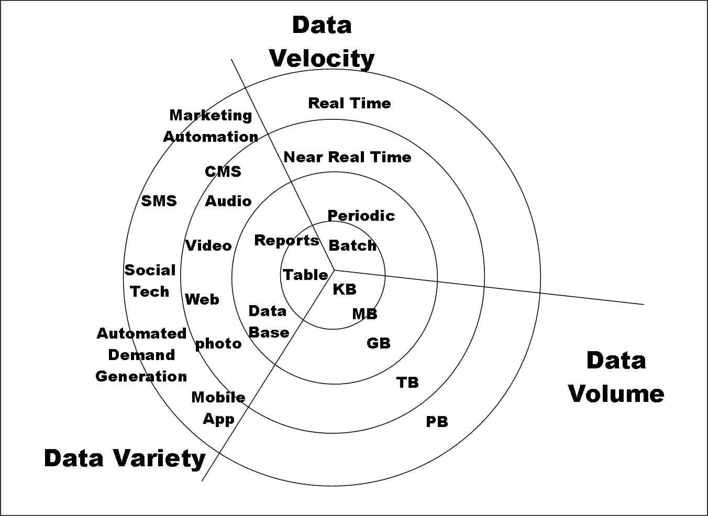
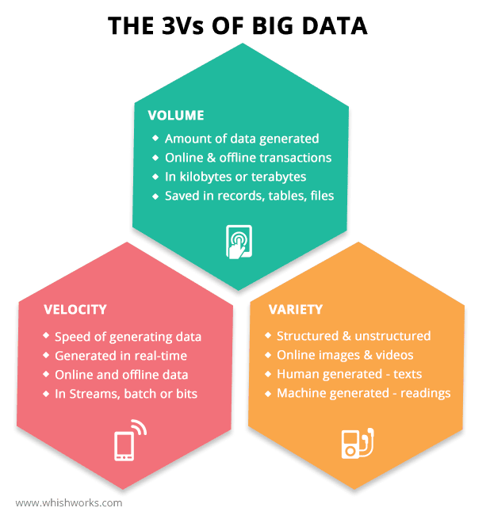
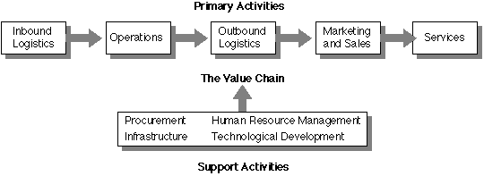
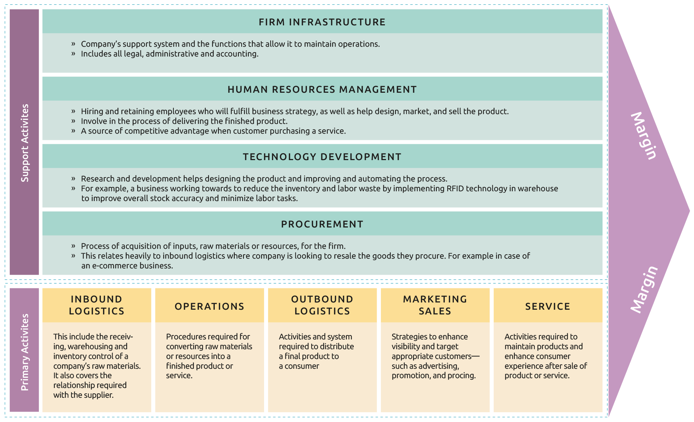
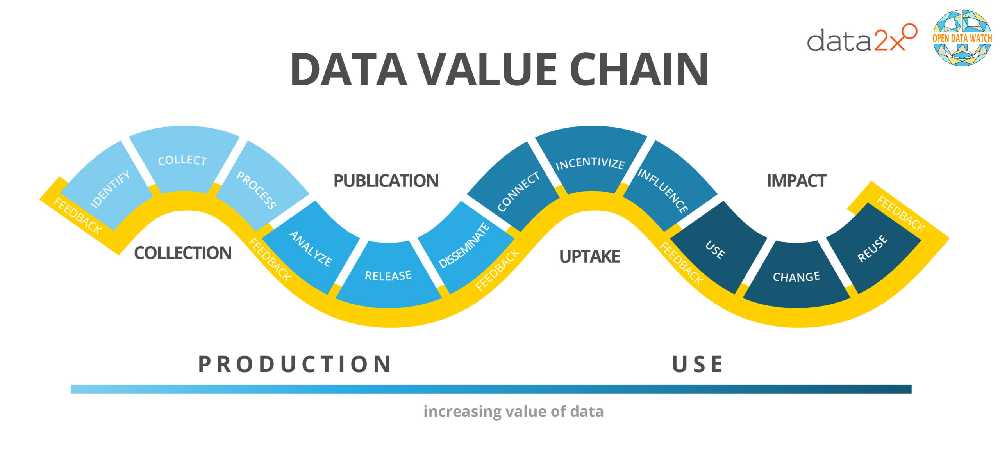
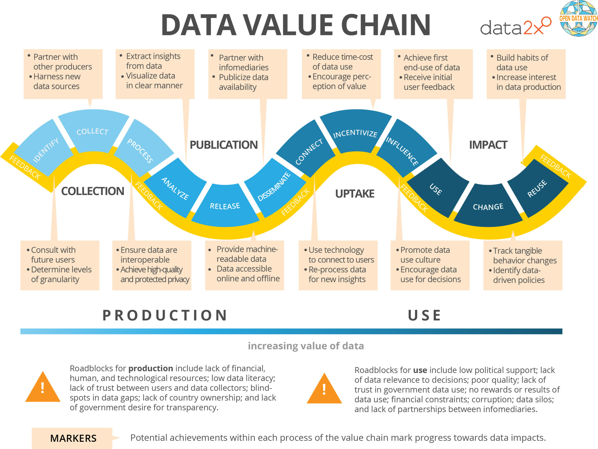
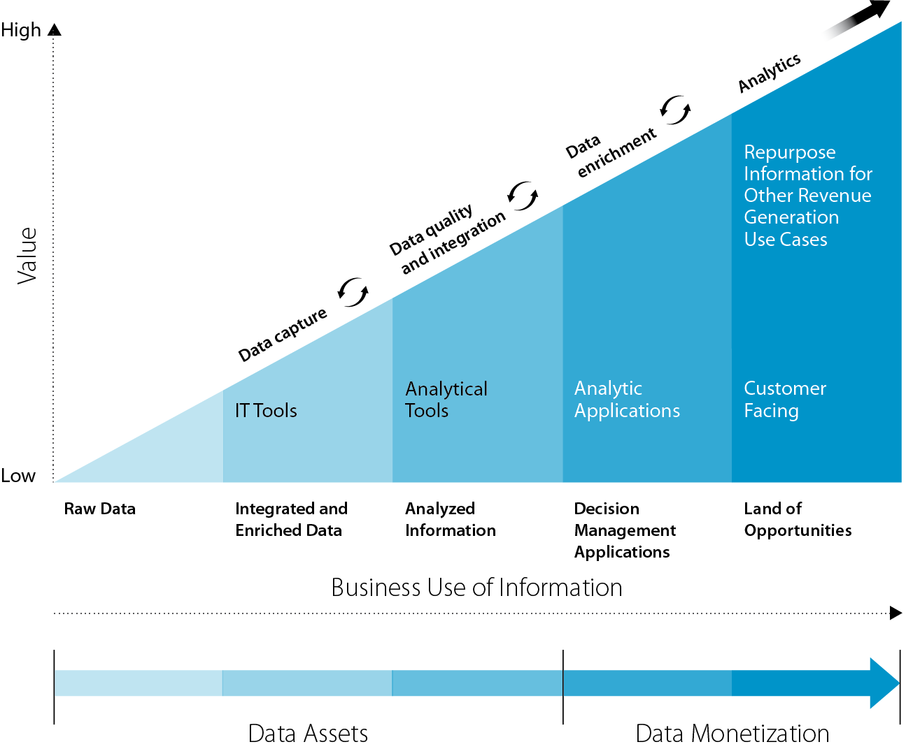
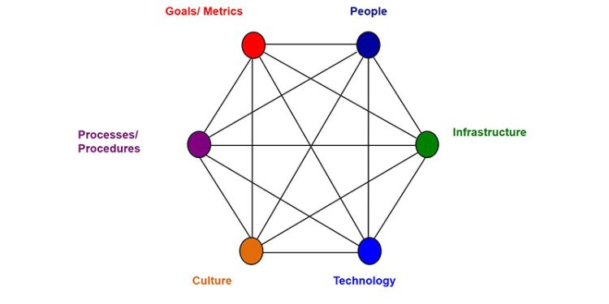

Structured and unstructured data are two primary categories of data that differ in their **organization**, **format**, and **ease of analysis**.

## Structured Data

Structured data refers to information that is organized in a predefined manner, typically in **rows** and **columns**, making it easily *searchable* and *analyzable*.

**Examples**:

- Customer databases (e.g., names, addresses, phone numbers)
- Transaction records (e.g., sales data)
- Inventory lists
- Sensor data in a structured format

## Unstructured Data

Unstructured data refers to information that does **not** have a predefined *format* or *structure*.

**Examples**:

- Social media posts and comments
- Emails and text messages
- Images and videos
- Web pages and blogs
- Sensor data in raw format

---

{fig-align="center"}

# Why is it important to distinguish between Structured and Unstructured Data?

# How to distinguish between Structured and Unstructured Data?

# Why did companies focus more on Structured data vs. Unstructured data?

{fig-align="center"}

---

# Fundamentals of Prompt Engineering

## LLM Modality:

1.	Text
2.	Image
3.	Speech

## Prompt Example (sentiment analysis):

1.	Take the text of the review (unstructured)
2.	Output the sentiment of the review
3.	Output should be the label (positive, neutral, or negative)
    -	Negative
    -	“Negative”!=”negative”
    -	“neg”!=”negative”

- Output should be a single number (number: structured)
- Output should be a single word (word: structured)

## Prompt Engineering

1.	Iterative process
2.	Best practices
3.	Techniques
    -	Zero shot prompt
    -	Few-shot prompt
    -	Chain of Thought
4.	Scalable
5.	Fast/Efficient
6.	Anatomy of effective prompts

## Anatomy of effective prompts

1. Role
2. Objective
3. Optional: specify limitations on the output

For instance:
*You are a sentiment analysis tool (**role**). Analyze the sentiment of the following customer review (**objective**). Classify it as Positive (1), Negative (-1), or Neutral (0) (**objective**). Your output should be a single number (**optional: specify limitations on the output**).*

# Big Data

Big Data refers to the vast volumes of **structured** and **unstructured** data that are generated at high velocity from various sources, including social media, sensors, devices, transactions, and more.

---

{fig-align="center"}

---

## Big Data is often characterized by the "Three Vs":

1. **Volume**: The amount of data generated is enormous, often measured in terabytes or petabytes.

2. **Velocity**: Data is generated and processed at an unprecedented speed (e.g., **Real-time**). 

3. **Variety**: Data comes in various formats, including **structured** data (like databases), and **unstructured** data (like text, images, and videos). 

---

{fig-align="center"}

---

# Data Storage

   - **Data Lakes**: 
    + Repositories that store vast amounts of **raw data** in its *native format* until it is needed for analysis.
   - **Data Warehouses**: 
    + *Centralized repositories* that store **structured** data from multiple sources, optimized for query and analysis.

# Data Processing Frameworks

- **Batch Processing**: Techniques that process large volumes of data **at once**, such as Apache Hadoop.

- **Stream Processing**: Techniques that analyze data in **real-time** as it is generated, such as Apache Kafka and Apache Flink.

# Analytics Tools

- **Descriptive Analytics**: Tools that summarize historical data to understand **what has happened** (e.g., dashboards, reporting tools).
- **Predictive Analytics**: Techniques that use statistical models and machine learning to **forecast future** outcomes based on historical data.
- **Prescriptive Analytics**: Advanced analytics that **recommends actions** based on data analysis, often using optimization algorithms.

# Porter's Value Chain

- The Porter Value Chain is a concept developed by Michael E. Porter in his 1985 book.

- It is a framework that helps businesses analyze their internal activities to identify areas where they can create value and gain a **competitive advantage**. 
- The value chain breaks down a company's activities into **primary** and **support** activities.
- allowing organizations to understand how each contributes to the overall **value** delivered to *customers*.

---

{fig-align="center"}

---

## **Primary Activities**

- 
   - **Inbound Logistics**: Receiving, warehousing, and inventory management of raw materials.
   - **Operations**: Processes that transform inputs into the final product or service.
   - **Outbound Logistics**: Activities required to get the finished product to the customer, including storage and order fulfillment.
   - **Marketing and Sales**: Strategies and activities to promote and sell the product or service.
   - **Service**: Activities related to maintaining and enhancing the product's value after purchase.

## **Support Activities**

   - **Procurement**: The process of acquiring the goods and services a company needs to carry out its operations.
   - **Technology Development**: Activities related to managing and developing technology, including research and development, process automation, and product design.
   - **Human Resource Management**: Activities related to recruiting, hiring, training, and developing the workforce.
   - **Firm Infrastructure**: Organizational structure, management, planning, finance, and quality control systems that support the entire value chain.

---

{fig-align="center"}

---

# Data Value Chain

## Data Value Chain

various stages involved in transforming **raw data** into **valuable insights** and **actionable outcomes**.

{fig-align="center"}

## Data Value Chain

1. **Data Generation**: This is the initial stage where data is **created** or **collected**. Data can come from various sources, including *sensors*, *transactions*, *social media*, *surveys*, etc.

2. **Data Collection**: In this stage, the generated data is gathered and **stored**. This may involve *data entry* (manual), *data scraping*, or *automated data collection* methods.

3. **Data Storage**: Once collected, data needs to be stored in a way that allows for **easy access** and **retrieval**. This can involve *databases*, *data lakes*, or *cloud storage* solutions.

---

{fig-align="center"}

---

## Data Value Chain

4. **Data Processing**: This stage involves **cleaning**, **transforming**, and **organizing** the data to make it suitable for analysis. Data processing may include *removing duplicates*, handling *missing values*, and converting data into a *standardized format*.

5. **Data Analysis**: In this phase, analytical techniques are applied to the processed data to **extract insights**. This can involve *statistical analysis*, *machine learning*, *data mining*, and other analytical methods to identify *patterns*, *trends*, and *correlations*.

6. **Data Visualization**: The insights gained from data analysis are often presented through visualizations, such as **charts**, **graphs**, and **dashboards**. This helps stakeholders understand the findings and make informed decisions.

---

{fig-align="center"}

---

## Data Value Chain

7. **Data Interpretation**: This stage involves interpreting the visualized data and insights to derive **meaningful conclusions**. It requires *domain knowledge* and *expertise* to understand the implications of the data.

8. **Data Utilization**: Finally, the insights are used to **inform decision-making**, drive **strategy**, improve **processes**, or **create new products and services**. This stage emphasizes the *practical application* of data insights to achieve business objectives.

9. **Feedback and Iteration**: The Data Value Chain is often **iterative**, meaning that *feedback from the utilization* stage can lead to *new data generation*, *collection*, and *analysis efforts*. This continuous cycle helps organizations adapt and improve their data strategies over time.

---

{fig-align="center"}

---

{fig-align="center"}

---

# Socio-Technical Systems

## Socio-Technical Systems

- Socio-Technical Systems (STS) refer to an approach to complex organizational work design that recognizes the interaction between **people** (the social system) and **technology** (the technical system).

- The concept emphasizes that both social and technical elements must be **considered together** to optimize performance, enhance productivity, and improve *overall system effectiveness*.

---

{fig-align="center"}

---

## **Social System**

- A **social system** refers to the network of **relationships**, **interactions**, and **structures** that exist among individuals and groups within a society or organization. 
- It encompasses the **social dynamics**, **norms**, **values**, **roles**, and **behaviors** that shape how people relate to one another and *work together*. 

## Characteristics of a Social System

- **Interdependence**: The members of a social system are interdependent, meaning that the actions of one individual or group can **impact others**. 

- **Adaptability**: Social systems **can adapt to changes** in their environment, including *shifts in technology*, *market conditions*, or *social norms*. 

- **Complexity**: Social systems are *complex* and *dynamic*, with multiple **interacting elements**. 
    - This complexity can lead to emergent behaviors that are **not easily predictable** based on the individual components.

- **Stability and Change**: While social systems strive for stability and cohesion, they are also subject to change. Factors such as **leadership changes**, **organizational restructuring**, or **shifts in external conditions** can disrupt the status quo.

## Technical System

- A **technical system** refers to the collection of **tools**, **technologies**, **processes**, and **structures** that are used to perform tasks and achieve objectives within an organization or a specific context.

## Components of a Technical System

1. **Hardware**: 
    - This includes the **physical devices** and equipment used in the system, such as *computers*, *servers*, *machinery*, and other tools.

2. **Software**: 
    - Software encompasses the **programs** and **applications** that run on *hardware*. 
        - This includes **operating systems**, **productivity software**, **specialized applications**, and **databases** that support various functions within the organization.

3. **Processes**: 
    - Technical systems involve specific processes and workflows that dictate **how** tasks are performed. 
    - **standard operating procedures**, **algorithms**, and **methodologies** that guide the use of technology.

## Components of a Technical System

4. **Data**: 
    - It includes the *information* that is **processed**, **stored**, and **analyzed** by the system.

5. **Networks**: 
    - local area networks (LANs), 
    - wide area networks (WANs), 
    - the internet

6. **User Interfaces**: 
    - The design of user interfaces (UIs) is crucial for ensuring that users can **effectively interact** with the technical system. 
    - Good UI design enhances **usability** and **user experience**, making it easier for individuals to perform their tasks.

7. **Support and Maintenance**: 
    - troubleshooting, 
    - updates, 
    - training for users to keep the system running smoothly.