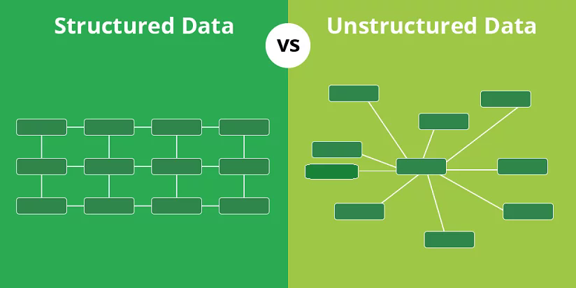
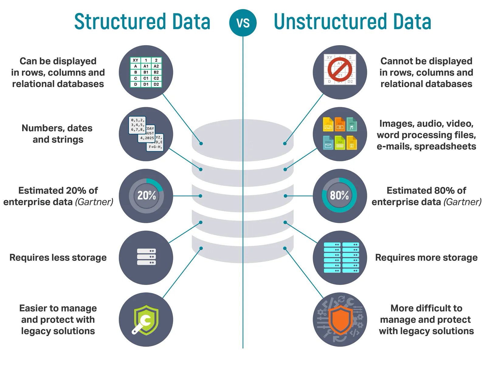

Structured and unstructured data are two primary categories of data that differ in their **organization**, **format**, and **ease of analysis**.

### Structured Data

Structured data refers to information that is organized in a predefined manner, typically in **rows** and **columns**, making it easily *searchable* and *analyzable*.

**Examples**:
- Customer databases (e.g., names, addresses, phone numbers)
- Transaction records (e.g., sales data)
- Inventory lists
- Sensor data in a structured format

### Unstructured Data

Unstructured data refers to information that does **not** have a predefined *format* or *structure*.

**Examples**:
- Social media posts and comments
- Emails and text messages
- Images and videos
- Web pages and blogs
- Sensor data in raw format

{fig-align="center"}

## Why is it important to distinguish between Structured and Unstructured Data?

---

## How to distinguish between Structured and Unstructured Data

# Why did companies focus more on Structured data vs. Unstructured data?

{fig-align="center"}

---

# Big Data

Big Data refers to the vast volumes of **structured** and **unstructured** data that are generated at high velocity from various sources, including social media, sensors, devices, transactions, and more.

