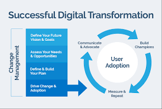
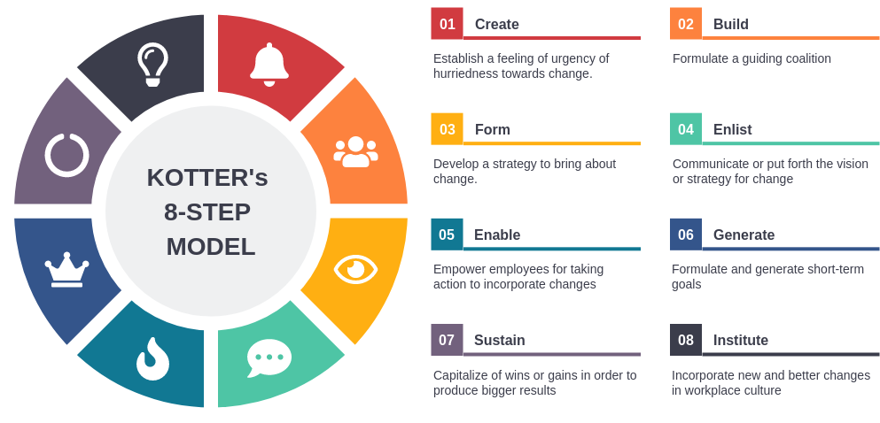

# Change Management in Digital Transformation

Change management ensures that organizations smoothly transition to digital transformation by aligning people, processes, and technology. This process requires four key steps:

{fig-align="center"}

1. **Define Your Future Vision & Goals**:  
   Clarify objectives for digital transformation to align with business strategy.

2. **Assess Your Needs & Opportunities**:  
   Analyze gaps, strengths, and potential benefits of transformation.

3. **Define & Build Your Plan**:  
   Develop a roadmap detailing steps, tools, and stakeholders involved.

4. **Drive Change & Adoption**:  
   Implement initiatives with leadership support and employee buy-in.

# Kotter's 8 Step Change Management

Kotter's 8-Step Change Management Model is a framework developed by Dr. John Kotter, a professor at Harvard Business School, to help organizations implement successful change initiatives. The model outlines a step-by-step process for leading change and is widely used in various industries. 

{fig-align="center"}

## The eight steps

1. **Create a Sense of Urgency**: Highlight the importance of change and the potential risks of not changing. This step involves communicating the need for change to motivate stakeholders and create a sense of urgency.

2. **Build a Guiding Coalition**: Form a group of influential people within the organization who can lead the change effort. This coalition should have the authority, expertise, and credibility to drive the change process.

3. **Form a Strategic Vision and Initiatives**: Develop a clear vision for the future and outline the initiatives that will help achieve that vision. This step involves articulating the desired outcomes and how the change will benefit the organization.

4. **Communicate the Vision**: Share the vision and strategy with all stakeholders. Effective communication is crucial to ensure that everyone understands the change and is aligned with the vision.

5. **Empower Broad-Based Action**: Remove obstacles that may hinder change and empower employees to take action. This may involve providing training, resources, and support to help individuals contribute to the change effort.

6. **Generate Short-Term Wins**: Create and celebrate short-term successes to build momentum and demonstrate the benefits of the change. Recognizing and rewarding achievements can help maintain motivation and support for the change initiative.

7. **Consolidate Gains and Produce More Change**: Use the credibility gained from short-term wins to tackle larger change initiatives. This step involves reinforcing the change and ensuring that it becomes part of the organizational culture.

8. **Anchor New Approaches in the Culture**: Ensure that the changes are integrated into the organization's culture and practices. This involves reinforcing the new behaviors and values through policies, procedures, and ongoing communication.

## The Case of Microsoft

One recent example of Kotter's 8-Step Change Management Model in action is the transformation undertaken by Microsoft under CEO Satya Nadella, particularly around 2014 when he took over leadership. Nadella's approach to change management aligns well with Kotter's framework, as he sought to shift the company's culture and focus towards cloud computing and collaboration.

### How Microsoft’s transformation can be mapped to Kotter’s 8 Steps

1. **Create a Sense of Urgency**: Nadella emphasized the need for Microsoft to adapt to a rapidly changing technology landscape, particularly the rise of cloud computing and mobile technology. He communicated the urgency of evolving from a traditional software company to a cloud-first, mobile-first organization.

2. **Build a Guiding Coalition**: Nadella built a strong leadership team that included executives from various divisions. This coalition was essential in driving the cultural shift and aligning the organization towards a common vision.

3. **Form a Strategic Vision and Initiatives**: Nadella articulated a clear vision for Microsoft’s future, focusing on cloud services, artificial intelligence, and collaboration tools. He introduced initiatives like Microsoft Azure and Office 365 to support this vision.

4. **Communicate the Vision**: Nadella effectively communicated the new vision through various channels, including company-wide meetings, emails, and public appearances. He encouraged open dialogue and feedback, fostering a culture of transparency.

5. **Empower Broad-Based Action**: Nadella encouraged employees to take risks and innovate. He removed bureaucratic obstacles and promoted a growth mindset, allowing teams to experiment and learn from failures.

6. **Generate Short-Term Wins**: Microsoft saw significant early successes with the adoption of Azure and the growth of Office 365. These wins were celebrated and communicated throughout the organization, reinforcing the change effort.

7. **Consolidate Gains and Produce More Change**: Building on the initial successes, Microsoft continued to invest in cloud technology and expand its product offerings. Nadella’s leadership helped to solidify the company’s position in the cloud market.

8. **Anchor New Approaches in the Culture**: Nadella worked to embed a culture of collaboration, inclusivity, and continuous learning within Microsoft. He emphasized values such as empathy and teamwork, ensuring that the new approaches became part of the organizational culture.

Through these steps, Microsoft successfully transformed its business model and culture, leading to significant growth and a renewed competitive edge in the technology industry. Nadella's leadership and the application of Kotter's change management principles have been widely recognized as key factors in this transformation.

## Essay #2 - Analyzing Change Management through Kotter's 8-Step Model

**Objective:**  
The objective of this assignment is to enable you to apply Kotter's 8-Step Change Management Model to a real-world organizational change initiative. You will analyze the change process, evaluate its effectiveness, and provide recommendations for improvement.

**Assignment Instructions:**

1. **Select a Case Study:**
   - Choose a recent organizational change initiative from a company of your choice. This could be a transformation in strategy, culture, technology, or structure. In the class we looked at Microsoft under Satya Nadella, but you should pick other relevant cases.

2. **Research the Change Initiative:**
   - Gather information about the selected change initiative. Use credible sources such as academic journals, business news articles, company reports, and interviews (if available). Focus on understanding the context, objectives, and outcomes of the change.
   - Your submission should be evidence-driven. Ensure citations for your claims.

3. **Apply Kotter's 8-Step Model:**
   - Analyze the change initiative using Kotter's 8-Step Change Management Model. For each step, provide a detailed evaluation.

4. **Evaluate the Effectiveness of the Change:**
   - Assess the overall effectiveness of the change initiative. Consider factors such as employee engagement, performance metrics, and stakeholder feedback. Discuss any challenges faced during the change process.

5. **Provide Recommendations:**
   - Based on your analysis, provide recommendations for improving the change management process. 
      + What lessons can be learned from this case study? 
      + How could the organization enhance its approach to future change initiatives?

6. **Format and Submission:**
   - The assignment should be 2,500 to 3,000 words in length, double-spaced, and formatted according to APA guidelines. Include a title page, table of contents, and references. Use at least 5 credible sources to support your analysis.

**Evaluation Criteria:**

- Content and Analysis
- Organization
- APA Style and Formatting
- Writing Quality

**Additional Notes:**

- Each student must work individually and submit their own written report.
- Be prepared to present your findings in a class discussion following the submission of the assignment.

# Prosci - ADKAR Change Management Model

The Prosci ADKAR Model is a widely recognized framework for change management developed by Prosci, a research and training organization focused on change management practices. The model is designed to help organizations manage change effectively by focusing on the individual aspects of change. ADKAR is an acronym that stands for the five key outcomes that individuals need to achieve for successful change.

{fig-align="center"}

1. **Awareness**: Individuals must be aware of the need for change. This involves understanding why the change is necessary and what the drivers behind it are. Effective communication is crucial at this stage to ensure that everyone understands the reasons for the change.

2. **Desire**: Once individuals are aware of the change, they need to have the desire to support and participate in it. This involves addressing any concerns or resistance and fostering a positive attitude towards the change. Engaging stakeholders and addressing their motivations can help build this desire.

3. **Knowledge**: Individuals must have the knowledge of how to change. This includes understanding the new processes, systems, or behaviors that will be implemented. Training and resources are essential to equip individuals with the necessary skills and information.

4. **Ability**: Having the knowledge is not enough; individuals must also be able to implement the change. This involves practicing new skills, overcoming obstacles, and ensuring that individuals can perform their roles effectively in the new environment.

5. **Reinforcement**: Finally, to sustain the change, individuals need reinforcement to ensure that the change is maintained over time. This can include recognition, rewards, and ongoing support to encourage continued adherence to the new ways of working.

