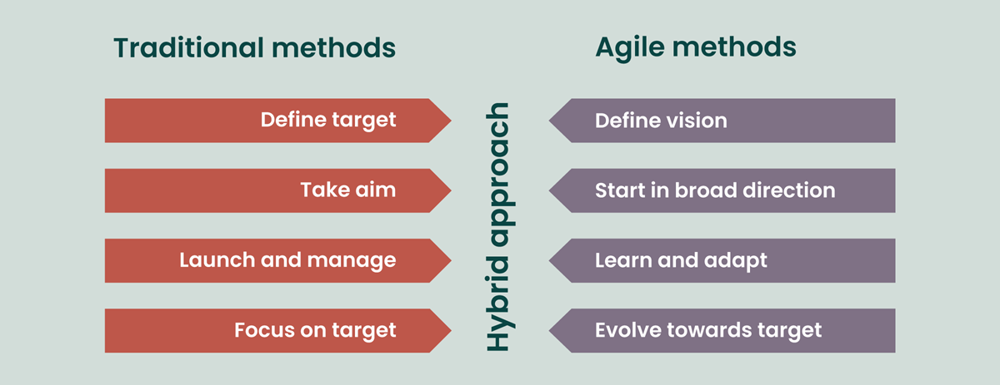

Agile Project Management is a flexible and iterative approach to managing projects, particularly in software development, but applicable to various fields. It emphasizes collaboration, customer feedback, and small, rapid releases of products or features. The Agile methodology is designed to accommodate change and deliver value to customers more efficiently.

# Traditional vs. Agile Project Management

{fig-align="center"}

1. **Goal Setting**:  
   - **Traditional**: Define a fixed target upfront based on detailed planning. This assumes stability and clear end goals, suitable for predictable environments.  
   - **Agile**: Define a flexible vision that serves as a guiding principle, allowing adjustments based on changing circumstances and feedback.

2. **Initial Steps**:  
   - **Traditional**: Take aim with detailed plans and schedules before starting the project. The focus is on minimizing deviations from the original plan.  
   - **Agile**: Begin in a broad direction with minimal but sufficient planning. Adjustments are expected as the project progresses.

3. **Execution**:  
   - **Traditional**: Launch the project and manage it according to the established plan. Any changes to the plan require formal processes and approvals.  
   - **Agile**: Learn and adapt continuously by breaking the project into smaller, manageable iterations. Feedback from stakeholders informs improvements after each iteration.

4. **Focus**:  
   - **Traditional**: Strictly focus on achieving the original target, with success measured by adherence to the initial plan, timeline, and budget.  
   - **Agile**: Evolve towards the target with iterative refinements. Success is measured by delivering value incrementally, even if the end goal shifts over time.

Agile methods are especially effective in complex, uncertain, or fast-changing environments, while traditional methods suit stable, well-defined projects.

# Key principles of Agile Project Management

1. **Iterative Development**: Projects are broken down into small, manageable units called iterations or sprints, typically lasting from one to four weeks. Each iteration results in a potentially shippable product increment.

2. **Customer Collaboration**: Agile emphasizes continuous collaboration with stakeholders and customers throughout the project. Regular feedback is sought to ensure that the product meets user needs and expectations.

3. **Cross-Functional Teams**: Agile teams are often composed of members with diverse skills who work collaboratively. This promotes better communication and faster problem-solving.

4. **Embracing Change**: Agile methodologies are designed to be adaptive. Changes in requirements, even late in the development process, are welcomed to ensure the final product is relevant and valuable.

5. **Focus on Delivering Value**: The primary goal is to deliver functional products that provide value to customers. Prioritization of features is based on customer needs and business value.

6. **Continuous Improvement**: Agile encourages teams to reflect on their processes and outcomes regularly, fostering a culture of continuous improvement.

Popular frameworks that implement Agile principles include Scrum, Kanban, and Extreme Programming (XP). Each framework has its own practices and roles but adheres to the core Agile values outlined in the Agile Manifesto, which emphasizes individuals and interactions, working software, customer collaboration, and responding to change over rigid processes and documentation. 
