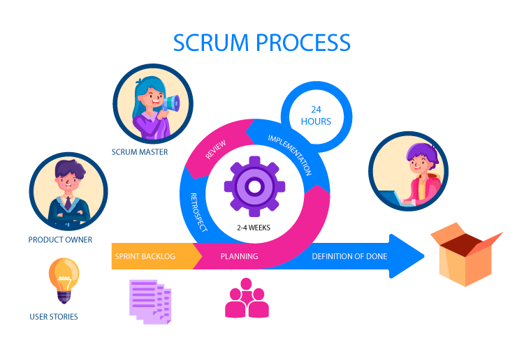
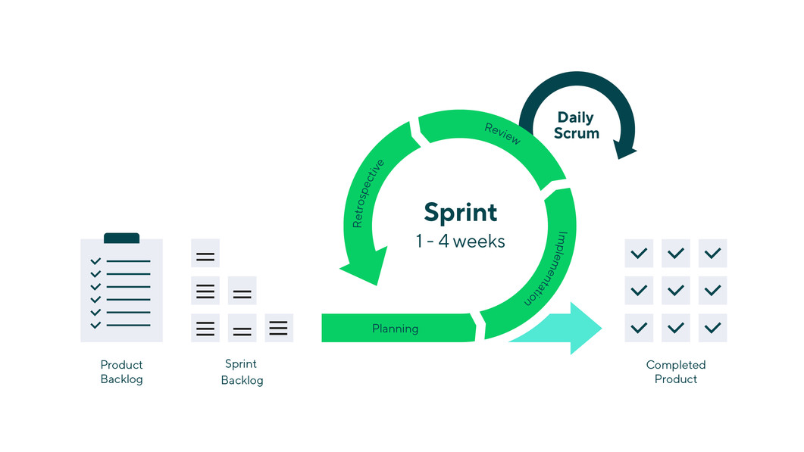

## Agenda

- The Case of Netflix
- Describe change management
- Importance of change management in digital transformation
- Agile project management
- Scrum
- Conclusion
- Q&A

## How Netflix Transformed The Movie Industry

**Prescriptive** Analytics for Strategic Decision-Making in Business

## Question

- What is **Prescriptive** Analytics?

## Question

- What other types of analytics do we have?

## Data analytics - Four key types

1. **Descriptive**: What happened?
2. **Diagnostic**: Why did this happen?
3. **Prescriptive**: What should we do next?
4. **Predictive**: What might happen in the future?

## Prescriptive Analytics

Definition:

- **Prescriptive analytics** is the process of using data to determine an *optimal course of action*, yielding **recommendations** for next steps.

## The case of

{fig-align="center"}

## Netflix Timeline

{fig-align="center"}

# What Netflix needs to consider for digital transformation

## Challenges and Considerations

**Technology**

- **Cloud infrastructure** to support demand
- **Video encoding** technology (high fidelity yet lightweight)

**Business**

- New **business model**: Movie rental -> Stream on demand
- **Competition** and **Piracy**
- Consumer **engagement** and **loyalty**

## Questions

- What challenges do organizations face when undergoing major changes?
- Why do employees often resist change?
- What strategies might help ensure smooth transitions during change?
- How can leaders align people and processes during transformation?

## Change Management

Change management ensures that organizations smoothly transition to digital transformation by aligning **people**, **processes**, and **technology**.

{fig-align="center"}

## Kotter's 8 Step Change Management

- Kotter's 8-Step Change Management Model is a framework developed by Dr. John Kotter, a professor at Harvard Business School, to help organizations implement **successful change initiatives**. 
- The model outlines a **step-by-step** process for leading change and is widely used in various industries. 

{fig-align="center"}

## Question

- How can leaders effectively create urgency without causing **panic** or **resistance**?

## The eight steps

1. **Create a Sense of Urgency**: 
    - Highlight the **importance of change** and the potential **risks of not changing**. 
    - This step involves **communicating** the need for change to **motivate** stakeholders and create a sense of urgency.

{fig-align="center"}

## Question

- What qualities should leaders look for when forming a guiding coalition?

## The eight steps

2. **Build a Guiding Coalition**: 
    - Form a group of **influential people** within the organization who can lead the change effort. 
    - This coalition should have the **authority**, **expertise**, and **credibility** to drive the change process.

{fig-align="center"}

## Question

- How can a compelling vision help unify and motivate employees during digital transformation?

## The eight steps

3. **Form a Strategic Vision and Initiatives**: 
    - Develop a clear **vision** for the future and outline the **initiatives** that will help achieve that vision.
    - This step involves **articulating** the **desired outcomes** and how the change will benefit the organization.

{fig-align="center"}

## Question

- What communication methods are most effective for ensuring employees understand and support the vision?

## The eight steps

4. **Communicate the Vision**: 
    - Share the vision and strategy with **all stakeholders**. 
    - Effective communication is crucial to ensure that *everyone* **understands** the change and is **aligned** with the vision.

{fig-align="center"}

## Question

- What challenges might organizations face when empowering employees to act on the change vision?

## The eight steps

5. **Empower Broad-Based Action**: 
    - Remove **obstacles** that may *hinder change* and empower employees to take **action**. 
    - This may involve providing **training**, **resources**, and **support** to help individuals contribute to the change effort.

{fig-align="center"}

## Question

- Why are short-term wins important for sustaining long-term change?

## The eight steps

6. **Generate Short-Term Wins**: 
    - Create and celebrate short-term successes to build **momentum** and **demonstrate** the *benefits* of the change. 
    - **Recognizing** and **rewarding** achievements can help maintain motivation and support for the change initiative.

{fig-align="center"}

## Question

- How can organizations avoid complacency after achieving initial success in change initiatives?

## The eight steps

7. **Consolidate Gains and Produce More Change**: 
    - Use the **credibility** gained from *short-term wins* to tackle **larger** change initiatives. 
    - This step involves **reinforcing** the *change* and ensuring that it becomes part of the organizational **culture**.

{fig-align="center"}

## Question

- What strategies can leaders use to ensure changes become permanent and part of the organizational culture?

## The eight steps

8. **Anchor New Approaches in the Culture**: 
    - Ensure that the changes are *integrated* into the organization's **culture** and **practices**. 
    - This involves reinforcing the new behaviors and values through **policies**, **procedures**, and **ongoing communication**.

{fig-align="center"}

## The Case of Microsoft

- Microsoft under CEO Satya Nadella
- around 2014 when he took over leadership 
- Nadella's approach to change management aligns well with Kotter's framework
- He sought to shift the company's **culture** 
- Focus towards **cloud computing**

{fig-align="center"}

## Microsoft’s transformation and Kotter’s 8 Steps

1. **Create a Sense of Urgency**: 
    - Nadella's emphasis on adapting to a **rapidly changing** technology landscape
    - the rise of **cloud computing** and **mobile** technology 
    - He communicated the urgency of evolving from a **traditional software** company to a **cloud-first**, **mobile-first** organization.

2. **Build a Guiding Coalition**: 
    - Nadella built a strong leadership team that included **executives** from *various divisions*. 
    
## Microsoft’s transformation and Kotter’s 8 Steps

3. **Form a Strategic Vision and Initiatives**: 
    - Nadella articulated a clear vision for Microsoft’s future: 
        - cloud services
        - artificial intelligence 
        - collaboration tools 
    - Introduced initiatives like **Microsoft Azure** and **Office 365** to support this vision

## Microsoft’s transformation and Kotter’s 8 Steps

4. **Communicate the Vision**: 
    - Through various channels: 
        - company-wide meetings, 
        - emails, 
        - public appearances 
    - He encouraged **open dialogue** and **feedback**, fostering a *culture of transparency*.

## Microsoft’s transformation and Kotter’s 8 Steps

5. **Empower Broad-Based Action**: 
    - Nadella encouraged employees to **take risks** and **innovate**. 
    - He removed **bureaucratic obstacles** and promoted a **growth mindset**, allowing teams to experiment and *learn from failures*.

6. **Generate Short-Term Wins**: 
    - Microsoft saw *significant early successes* with the adoption of Azure and the growth of Office 365. 
    - These wins were **celebrated** and **communicated** throughout the organization.

## Microsoft’s transformation and Kotter’s 8 Steps

7. **Consolidate Gains and Produce More Change**: 
    - Building on the initial successes, Microsoft continued to **invest** in cloud technology and expand its **product offerings**. 
    - Nadella’s leadership helped to **solidify** the company’s position in the *cloud market*.

8. **Anchor New Approaches in the Culture**: 
    - Nadella worked to embed a culture of **collaboration**, **inclusivity**, and **continuous learning** within Microsoft. 
    - He emphasized values such as **empathy** and **teamwork**
    - Ensuring that the new approaches became part of the **organizational culture**.

# Essay #2 - Analyzing Change Management through Kotter's 8-Step Model

## Objective

- The objective of this assignment is to enable you to apply **Kotter's 8-Step Change Management Model** to a **real-world** organizational change initiative. 
- You will **analyze the change process**, **evaluate its effectiveness**, and **provide recommendations** for improvement.

## Assignment Instructions

1. **Select a Case Study:**
   - Choose a *recent* organizational change initiative from a company of your choice. 
   - This could be a transformation in strategy, culture, technology, or structure. 
   - In the class we looked at Microsoft under Satya Nadella, but you should pick other relevant cases.

## Assignment Instructions

2. **Research the Change Initiative:**
   - Gather information about the selected change initiative. 
   - Use credible sources such as academic journals, business news articles, company reports, and interviews (if available). 
   - Focus on understanding the context, objectives, and outcomes of the change.
   - Your submission should be evidence-driven. 
   - Ensure citations for your claims.

## Assignment Instructions

3. **Apply Kotter's 8-Step Model:**
   - Analyze the change initiative using Kotter's 8-Step Change Management Model. 
   - For each step, provide a detailed evaluation.

## Assignment Instructions

4. **Evaluate the Effectiveness of the Change:**
   - Assess the overall effectiveness of the change initiative. 
   - Consider factors such as employee engagement, performance metrics, and stakeholder feedback. 
   - Discuss any challenges faced during the change process.

## Assignment Instructions

5. **Provide Recommendations:**
   - Based on your analysis, provide recommendations for improving the change management process. 
      + What lessons can be learned from this case study? 
      + How could the organization enhance its approach to future change initiatives?

## Assignment Instructions

6. **Format and Submission:**
   - The assignment should be 2,500 to 3,000 words in length, double-spaced, and formatted according to APA guidelines. 
   - Include a title page, table of contents, and references. 
   - Use at least 5 credible sources to support your analysis.

## Evaluation Criteria

- Content and Analysis
- Organization
- APA Style and Formatting
- Writing Quality

### Additional Notes
- Each student must work individually and submit their own written report.
- Be prepared to present your findings in a class discussion following the submission of the assignment.

# Prosci - ADKAR Change Management Model

- The **Prosci ADKAR Model** is a widely recognized framework for change management 
- Developed by Prosci, a research and training organization focused on change management practices. 
- The model is designed to help organizations **manage change effectively** by focusing on the **individual aspects of change**. 
- ADKAR is an *acronym* that stands for the *five key outcomes* that **individuals** need to achieve for successful change.

---

{fig-align="center"}

---

## Question

- Why is it important for employees to understand the reasons behind a change initiative?

## Prosci - ADKAR Change Management Model

1. **Awareness**: 
    - Individuals must be aware of the **need for change**. 
    - This involves understanding *why the change is necessary* and what the *drivers behind it* are.
    - **Effective communication** is crucial at this stage to ensure that everyone understands the *reasons for the change*.

## Question

- How can personal motivations and emotions influence an individual’s willingness to support change?

## Prosci - ADKAR Change Management Model

2. **Desire**: 
    - Once individuals are aware of the change, they need to have the desire to **support** and **participate** in it. 
    - This involves addressing any **concerns** or **resistance** and fostering a **positive attitude** towards the change. 
    - Engaging **stakeholders** and addressing their motivations can help build this desire.

## Question

- What happens if employees understand the need for change but lack the necessary knowledge to implement it?

## Prosci - ADKAR Change Management Model

3. **Knowledge**: 
    - Individuals must have the knowledge of **how to change**. 
    - This includes **understanding** the *new processes*, *systems*, or *behaviors* that will be implemented. 
    - **Training** and **resources** are essential to equip individuals with the necessary skills and information.

## Question

- Why is practical application of skills essential for successful change implementation?

## Prosci - ADKAR Change Management Model

4. **Ability**: 
    - Having the knowledge is not enough
    - individuals must also be able to **implement** the change. 
    - This involves practicing **new skills**, **overcoming obstacles**

## Question

- What risks do organizations face if they fail to reinforce changes after implementation?

## Prosci - ADKAR Change Management Model

5. **Reinforcement**: 
    - Individuals need reinforcement to ensure that the change is **maintained over time**. 
    - This can include **recognition**, **rewards**, and **ongoing support** to encourage continued adherence to the new ways of working.

---

{fig-align="center"}

---

# Agile Project Management

## Question

- Why do traditional project management methods often struggle to adapt to rapidly changing requirements?

## Agile Project Management

- A flexible and iterative approach to **managing projects** 
- Particularly in software development
- Applicable to various fields 
- Emphasizes **collaboration**, **customer feedback**, and **small, rapid releases of products or features**. 
- Designed to **accommodate change** and **deliver value** to customers more *efficiently*.

## Agile Project Management

{fig-align="center"}

## Traditional vs. Agile Project Management

1. **Goal Setting**:  
   - **Traditional**: 
    - Define a **fixed target** 
    - **upfront** 
    - Based on **detailed planning**. 
    - Assumes **stability** and **clear end goals** 
    - Suitable for predictable environments  
   - **Agile**: 
    - Define a **flexible** vision 
    - serves as a **guiding principle**
    - allowing **adjustments** based on *changing circumstances and feedback*.

## Traditional vs. Agile Project Management

2. **Initial Steps**:  
   - **Traditional**: 
    - *Take aim* with detailed plans and schedules **before starting** the project. 
    - The focus is on **minimizing deviations** from the original plan.  
   - **Agile**: 
    - Begin in a **broad direction** with *minimal* but sufficient planning. 
    - **Adjustments** are expected as the project progresses.

## Traditional vs. Agile Project Management

3. **Execution**:  
   - **Traditional**: 
    - Launch the project and manage it according to the **established plan**. 
    - Any **changes** to the plan require **formal processes and approvals**.  
   - **Agile**: 
    - Learn and **adapt continuously** by breaking the project into *smaller*, *manageable iterations*. 
    - **Feedback from stakeholders** informs *improvements after each iteration*.

## Traditional vs. Agile Project Management

4. **Focus**:  
   - **Traditional**: 
    - Strictly focus on achieving the **original target**, 
    - Success measured by adherence to the **initial plan, timeline, and budget**.  
   - **Agile**: 
    - Evolve towards the target with **iterative refinements**. 
    - Success is measured by **delivering value incrementally**, even if the *end goal shifts* over time.

# Scrum

## Question

- What challenges might arise when managing complex projects with multiple stakeholders?

## Scrum

- Scrum is an Agile framework 
- **iterative and incremental development** 
- Particularly popular in *software development* 
- Can be applied to various fields

## Scrum

{fig-align="center"}

- The term "Scrum" originates from the game of **rugby**. 
- In rugby, a "scrum" is a method of **restarting play** after a *minor infraction*
- players from each team pack *closely together* with their heads down and attempt to **gain possession** of the ball.

## Scrum

{fig-align="center"}

- The use of the term in the context of project management was popularized by Ken Schwaber and Jeff Sutherland, 
- Developed the Scrum framework in the early 1990s 
- They chose the name "Scrum" to reflect the importance of **teamwork** and **collaboration** in the development process
- Similar to how players in a rugby scrum must work together to succeed.

## Scrum

{fig-align="center"}

- In their 1995 paper titled "Scrum Development Process," 
- Schwaber and Sutherland drew parallels between the dynamics of a **rugby scrum** and the collaborative nature of **Agile software development**, 
- teams should be **self-organizing** 
- Iterative development, continuous feedback, and adaptability.

## Principles of Scrum

{fig-align="center"}

# Principles of Scrum

## 1. Empirical Process Control

- **Definition**: 
    - This principle is based on the idea that **knowledge comes from experience** 
    - decisions should be made based on **what is known**.
- **Application in Scrum**: 
    - Scrum relies on three key pillars: 
        - **Transparency**, 
        - **Inspection**, 
        - **Adaptation**. 
  - **Transparency** ensures that **all aspects** of the process are visible to *those responsible for the outcome*.
  - **Inspection** involves **regularly** checking **progress and performance** to identify any **deviations** from the expected results.
  - **Adaptation** means **adjusting** processes and plans based on the **insights gained from inspection**.

## 2. Self-Organization

- **Definition**: 
    - Teams are empowered to **organize** their work **without being directed** by outside authorities.
- **Application in Scrum**: 
    - Scrum teams are **cross-functional** and **self-managing**, 
    - They decide **how** to accomplish their work. 
    - This autonomy fosters **creativity**, **accountability**, and **a sense of ownership** among team members, 
    - leading to higher **motivation** and better **results**.

## 3. Collaboration

- **Definition**: 
    - Effective **teamwork** and **communication** are essential in Scrum.
- **Application in Scrum**: 
    - Scrum promotes collaboration among team members, stakeholders, and customers. 
    - *Regular ceremonies*, 
        - **Daily Scrums**, 
        - **Sprint Reviews**, 
        - **Retrospectives**, 
        
## 4. Value-Based Prioritization
- **Definition**: 
    - Work should be prioritized based on the **value** it delivers to the customer and the business.
- **Application in Scrum**: 
    - **The Product Owner** is responsible for managing the **Product Backlog** and prioritizing items based on their **value**. 
    - Ensures that the team focuses on **delivering** the **most important features first**, maximizing the *return on investment* and ensuring that *customer needs* are met.

## 5. Time Boxing

- **Definition**: 
    - Time boxing involves setting **fixed time limits** for activities to create a sense of **urgency** and **focus**.

## 6. Iterative Development

- **Definition**: 
    - Development is carried out in **small**, **incremental cycles**, allowing for regular **feedback and adjustments**.

## Scrum Methodology

{fig-align="center"}

*Note. backlog refers to a prioritized list of work items or tasks that need to be completed for a project*

## 1. **Roles in Scrum**

Scrum defines three primary roles, each with specific responsibilities:

- **Product Owner**:
  - Represents the **stakeholders** and the voice of the **customer**.
  - Responsible for defining the **product vision** and managing the **product backlog**.
  - Ensures that the **team understands** the *items in the backlog*.

## 1. **Roles in Scrum**

- **Scrum Master**:
  - Acts as a *facilitator* and *coach* for the Scrum team.
  - **Removes impediments** that may hinder the team's progress.
  - Shields the team from **external distractions** and **interruptions**.

## 1. **Roles in Scrum**

- **Development Team**:
  - A **cross-functional** group of professionals who work collaboratively to deliver the product increment.
  - Typically consists of **3 to 9 members** with various skills (e.g., *developers*, *testers*, *designers*).
  - **Self-organizes** to determine how to accomplish the work in the sprint.

## Question

- How can **regular events** like daily meetings improve team collaboration and accountability?

## 2. **Events in Scrum**

{fig-align="center"}

Events (ceremonies) that structure the workflow:

- **Sprint**:
  - A **time-boxed iteration**, usually lasting *1 to 4 weeks*
  - A *potentially shippable product* increment is created.
  - Each sprint begins with a **planning session** and ends with a **review and retrospective**.

## 2. **Events in Scrum**

- **Sprint Planning**:
  - A meeting held at the beginning of each sprint where the team decides **what work will be done**.
  - The team selects **items from the product backlog** to include in the **sprint backlog** based on priority and team capacity.
  - The team defines the **sprint goal**, which is a clear objective for the sprint.

## 2. **Events in Scrum**

- **Daily Scrum (Stand-up)**:
  - A **short**, **time-boxed** meeting (*usually 15 minutes*) held every day during the sprint.
  - Team members answer three questions: 
    + What did I do yesterday? 
    + What will I do today? 
    + What obstacles are in my way?

  - The purpose is to **synchronize** activities and identify any **impediments**.

## 2. **Events in Scrum**

- **Sprint Review**:
  - A meeting held at the **end** of the sprint to **demonstrate** the *completed work* to stakeholders.
  - The team presents the *product increment* and gathers **feedback**.
  - The *product backlog* may be **adjusted** based on feedback received.

## 2. **Events in Scrum**

- **Sprint Retrospective**:
  - A meeting held **after** the sprint review to reflect on the sprint process.
  - The team discusses 
    - *what went well*, 
    - *what could be improved*, 
    - *how to implement changes* in the next sprint.

## 3. **Artifacts in Scrum**

Scrum uses specific artifacts to *manage* work and provide *transparency*:

- **Product Backlog**:
  - An **ordered** list of all desired work on the project, 
    - features, 
    - enhancements, 
    - bug fixes, 
    - technical tasks.
  - The **product owner** is responsible for maintaining and prioritizing the backlog.

## 3. **Artifacts in Scrum**

- **Sprint Backlog**:
  - A subset of the product backlog items selected for the **current sprint**, 
  - The **development team** is responsible for managing the sprint backlog.

## 3. **Artifacts in Scrum**

- **Increment**:
  - The **sum of all completed** product backlog items at the end of a sprint.
  - The increment must meet the team's *definition* of **"done,"** which includes **quality** criteria and **acceptance** criteria.

## 2. **Events in Scrum**

{fig-align="center"}

## Conclusion

-  Kotter's 8 Step Change Management
- The Case of Microsoft and Essay #2 - Analyzing Change Management through Kotter's 8-Step Model
- Prosci - ADKAR Change Management Model
- Traditional vs. Agile Project Management
- Scrum principles, methodology, events, and artifacts

# Q&A