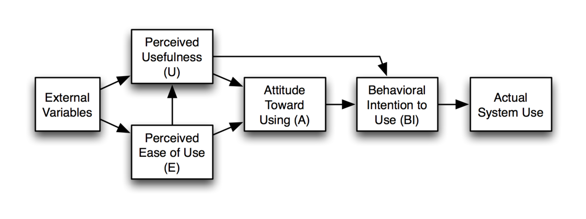
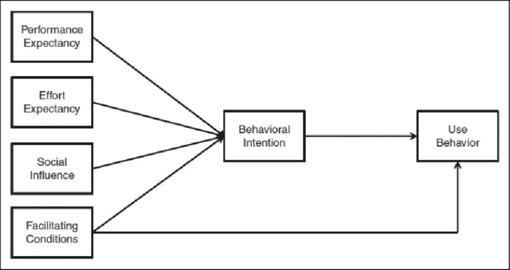
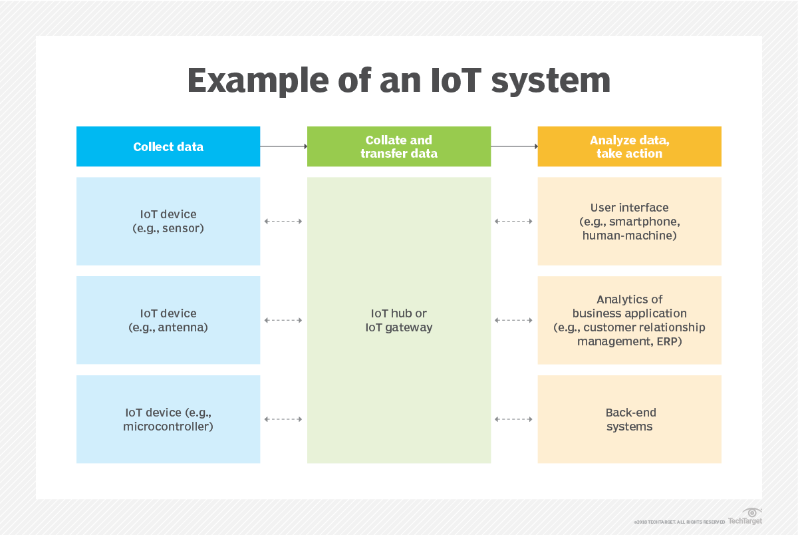
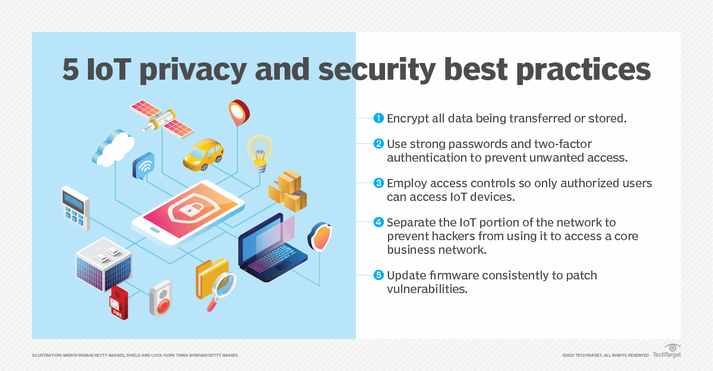
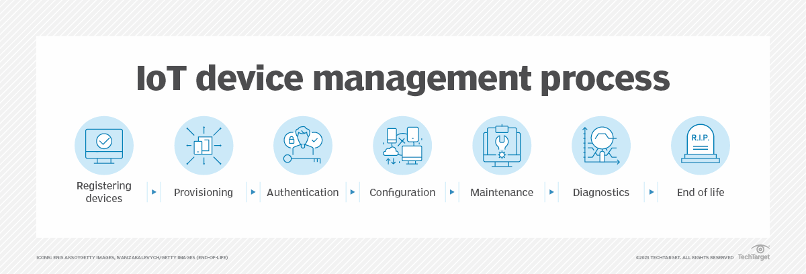

## Agenda

- Discuss technology acceptance models:
    - TAM
    - UTAUT

- Difference between IoT, Cloud, Edge, and Fog Computing
- Conclusion
- Q&A

## Question

- Think of a time you adopted a new app or tool (e.g., TikTok, Zoom, ChatGPT, a fitness tracker). 
What specific factors convinced you to use it? 
Was it because it solved a problem quickly, was easy to learn, or because peers recommended it? 
If you avoided a tool (e.g., Twitter/X, a new software update), what turned you off?

- Did you care more about how intuitive it was or how much value it added? 
For example, did you stick with Instagram Reels because it felt familiar, or switch to TikTok for better features?

# Technology Acceptance Model (TAM)

{fig-align="center"}

## Technology Acceptance Model (TAM)

- The Technology Acceptance Model (TAM) is a theoretical framework that helps to *explain* and *predict* how users come to **accept and use** a technology. 
- Developed by Fred Davis in 1986, TAM is widely used in *information systems* research to understand user behavior regarding technology adoption.

## Components of TAM

- **External variables**: 
    - Factors outside the model that influence **perceived usefulness (U)** and **perceived ease of use (E)**.

    1. **System Features**: 
        - The **functionality**, **design**, and **interface** of the technology.  
    2. **User Characteristics**: 
        - **Age**, **education**, **prior experience**, or **computer self-efficacy**.  
    3. **Social Influence**: 
        - **Peer pressure**, **organizational culture**, or **support from leadership**.  
    4. **Training and Support**: 
        - Availability of **resources to help** users understand the system.  
    5. **Task Characteristics**: 
        - **Complexity** and **relevance** of the tasks the technology is designed to support.

{fig-align="center"}

## Components of TAM

1. **Perceived Usefulness (PU)**: 
    - The degree to which a person believes that using a particular technology will enhance their **job performance or productivity**. 
    - If users perceive a technology as useful, they are **more likely** to adopt it.

{fig-align="center"}

## Components of TAM

2. **Perceived Ease of Use (PEOU)**: 
    - This is the degree to which a person believes that using a technology will be **free of effort**. 
    - If a technology is easy to use, users are **more likely** to accept and utilize it.

{fig-align="center"}

## Components of TAM

- **Attitude Toward Use**: 
    - **Determined by** perceived usefulness and perceived ease of use 
    - A positive attitude can lead to a higher likelihood of **technology adoption**.

{fig-align="center"}

## Components of TAM

- **Behavioral Intention to Use**: The attitude toward use affects the behavioral intention to use the technology. 

{fig-align="center"}

# Example: Application of TAM in E-Commerce  

## Example: Application of TAM in E-Commerce

- **BestBuy** is introducing a new *AI-powered virtual shopping assistant* to improve the online shopping experience.
- The **Technology Acceptance Model (TAM)** can be applied to analyze how customers adopt this technology.

---

## TAM for BestBuy  

**External Variables**

1. **System Features:** The virtual assistant provides **personalized product recommendations** and fast responses.  
2. **User Characteristics:** Target audience includes **tech-savvy millennials** who are comfortable using AI-based tools.  
3. **Social Influence:** **Online reviews** and **endorsements** by influencers promote the virtual assistant.  
4. **Training and Support:** **Tutorials** and **FAQs** are provided to educate users on how to use the assistant.  

## TAM for BestBuy  

**Perceived Ease of Use (U)**
- Do users believe the assistant is **easy to interact with** due to its intuitive chat interface? 
- Should we add voice commands?
- How is adding more features reducing the ease of use?

**Perceived Usefulness (E)**
- Do customers find the assistant helpful because it **saves time** by suggesting relevant products and streamlining the shopping process?

## TAM for BestBuy  

**Attitude Toward Using (A)**  
- Do positive perceptions of usefulness and ease of use lead customers to **feel favorable** toward using the virtual assistant?  

**Behavioral Intention to Use (B)**  
- Because of their positive attitude, do customers **intend** to use the assistant in their future shopping activities?  

**Actual System Use**
- Over time, do users actively use the virtual assistant to explore and purchase products on the e-commerce platform?

---

## Measuring Benefits of Technology
1. Increased **customer satisfaction** due to a smoother shopping experience?  
2. Higher **conversion rates** as customers are more likely to complete purchases?  
3. Enhanced **brand loyalty** as users find the platform innovative and user-friendly?  

---

## Discussion Questions

1. How can perceived ease of use be improved for users who are **less tech-savvy**? (Minority group) 

## Discussion Questions

2. What **additional features** could make the virtual shopping assistant more useful?  

## Discussion Questions

3. How can social influence, such as **peer reviews**, be leveraged to encourage adoption?  

## Research Questions

4. What AI tool can be incorporated to give the chatbot access to BestBuy's product catalog and manuals?

# Example: TAM for AI Chatbots in a Hospital

- A hospital adopts an AI-powered chatbot to assist patients in **triage**, 
- offering **preliminary medical advice** 
- determining whether they need **urgent care** or can manage their symptoms **at home**. 
- TAM can help evaluate how *staff* and *patients* accept this technology.

---

## TAM for AI Chatbots in a Hospital 

**External Variables**  
1. **System Features:** 
    - The chatbot uses natural language processing (NLP) to understand **patient queries** and provides **accurate recommendations** based on *medical databases*.  
2. **User Characteristics:** 
    - **Patients** may range from *tech-savvy individuals* to *older adults with limited technology experience*.
    - **Nurses** may initially feel skeptical about its reliability.
    - **Medical doctors** who feel threatened.  

## TAM for AI Chatbots in a Hospital 

3. **Social Influence:** 
    - **Healthcare professionals** and **community leaders** endorse the chatbot, increasing **trust** among patients.  
4. **Training and Support:** 
    - Hospitals offer **tutorials** and **demos** to help *patients* and *staff* navigate the chatbot.  

## TAM for AI Chatbots in a Hospital 

- **Perceived Ease of Use (E)**
    - Patients find the chatbot user-friendly because of its **simple interface**, **quick responses**, and ability to handle **non-technical language**.  

- **Perceived Usefulness (U)**  
    - The chatbot **reduces waiting times** and improves patient outcomes by streamlining the triage process. 
    - Medical staff find it useful as it filters **non-urgent cases**, allowing them to focus on **critical** patients.  

## TAM for AI Chatbots in a Hospital 

- **Attitude Toward Using (A)**  
    - Both patients and staff develop a *positive attitude* toward the chatbot, appreciating its efficiency and time-saving benefits.  

- **Behavioral Intention to Use (BI)**  
    - Due to their favorable attitude, patients and staff *intend to use* the chatbot regularly. Patients plan to consult it for initial assessments, while staff use its data to prioritize cases.  

- **Actual System Use**  
    - The chatbot becomes widely used in the hospital, helping patients and supporting staff during **peak hours** or **emergencies**.  

---

## Benefits for the Hospital  
1. **Improved Patient Experience:** 
    - Patients receive quicker responses and guidance for their symptoms.  
2. **Optimized Staff Workload:** 
    - Staff focus on urgent cases, improving care quality.  
3. **Operational Efficiency:** 
    - Triage times are reduced, leading to better *resource allocation*.  

---

## Discussion Questions  

1. How can hospitals ensure the chatbot's ease of use for elderly patients or those with limited digital literacy?  

## Discussion Questions  

2. What measures can be taken to build trust in the chatbot's reliability among medical staff?  

## Discussion Questions  

3. How might the chatbot’s usefulness increase if integrated with electronic health records (EHRs)?  

## Research Question  

4. What AI tool can help integrate electronic health records (EHRs) into the chatbot?  

# Example: TAM for IKEA’s Self-Return Kiosk  

- IKEA has introduced a self-return kiosk at its stores
- Customers **should** process product returns without staff assistance. 
- Let's apply TAM to understand how customers would accept this technology.

---

## TAM for IKEA’s Self-Return Kiosk  

**External Variables**  

1. **System Features:** 
    - The kiosk features 
        - a touch screen, 
        - clear instructions, 
        - barcode scanner.  
2. **User Characteristics:** 
    - Customers vary in their familiarity with self-service technologies, 
    - from *tech-savvy individuals* to those who *prefer in-person interaction*.  

## TAM for IKEA’s Self-Return Kiosk  

3. **Social Influence:** 
    - *Other customers* using the kiosk successfully *influence* hesitant users to try it.  
4. **Training and Support:** 
    - **On-screen guidance** and **staff nearby** to assist reduce apprehension among first-time users.  

## TAM for IKEA’s Self-Return Kiosk  

**Perceived Ease of Use (E)**

    - Customers find the kiosk intuitive due to its **step-by-step instructions**, **visual aids**, and **quick processing time**.  

**Perceived Usefulness (U)**  

- The kiosk eliminates **waiting in line**
- This is particularly beneficial during **peak hours**.  

## TAM for IKEA’s Self-Return Kiosk  

**Attitude Toward Using (A)**  

- Customers to **view** the kiosk as an effective solution.  

**Behavioral Intention to Use (BI)**  

- Customers **intend** to use the kiosk for future returns and may **recommend** it to others.  

**Actual System Use**  

- Over time, the kiosk sees increased adoption, with customers actively using it for returns, leading to faster service times and reduced staff workload.  

## Question

- Think about your own experience: when forced to use a new technology in public what types of apprehensions do you face?
- How can these apprehensions be alleviated?

## Benefits for IKEA  
1. **Enhanced Customer Experience:** 
    - **Faster returns** process improves overall satisfaction.  
2. **Operational Efficiency:** 
    - Staff focus on **complex issues** while routine returns are handled by the kiosk.  
3. **Cost Savings:** 
    - Lower dependency on staff for **simple returns** reduces operational costs.  

---

## Discussion Questions  

1. What **design elements** can IKEA add to make the kiosk more accessible to older customers?  

## Discussion Questions  

2. How can IKEA promote the kiosk to customers **hesitant** about using technology?  

## Discussion Questions  

3. What features could make the kiosk even more useful (e.g., integrating loyalty rewards during returns)?  

# The Unified Theory of Acceptance and Use of Technology (UTAUT)

## Question

- Your company recently rolled out a new collaboration platform (e.g., Slack, Asana, or a mandatory AI tool). 
While TAM focuses on perceived usefulness and ease of use, what one factor outside of these two do you think most influenced adoption or resistance? 
For example, was it pressure from leadership, lack of training, or compatibility with existing workflows? Use a real-world case to argue why this factor mattered more than pure ‘usefulness’ or ‘ease of use’.

## The Unified Theory of Acceptance and Use of Technology (UTAUT)

- The Unified Theory of Acceptance and Use of Technology (UTAUT) is a theoretical framework developed to understand the factors that influence individuals' **acceptance and use** of technology. 
- It was introduced by Venkatesh et al. in **2003** 
- integrates elements from several existing models of technology acceptance, 
    - Technology Acceptance Model (TAM), 
    - Theory of Planned Behavior (TPB), 
    - Motivational Model.

{fig-align="center"}

## The Unified Theory of Acceptance and Use of Technology (UTAUT)

- **Four** primary constructs that significantly influence technology acceptance and usage:

1. **Performance Expectancy**: 
    - How much the technology is perceived to **enhance job performance**. 

2. **Effort Expectancy**: 
    - This construct reflects the **ease of use** associated with the technology. 

3. **Social Influence**: 
    - How much individuals perceive that **important others (e.g., peers, family, or colleagues)** believe they should use the new technology. 
    
4. **Facilitating Conditions**: 
    - The **resources and support** available to individuals for using the technology, 
        - infrastructure, 
        - training, 
        - technical support. 

{fig-align="center"}

## Moderating Variables

- What are **moderators** in a theoretical framework?

## Moderating Variables

- **Age**: 
    - Different age groups may have varying levels of technology acceptance.
- **Gender**: 
    - Men and women may have different perceptions and attitudes toward technology.
- **Experience**: 
    - Prior experience with similar technologies can influence acceptance.
- **Voluntariness of Use**: 
    - Whether the use of the technology is mandatory or voluntary can affect acceptance.

## UTAUT for IKEA's Self-Return Kiosk  

- **Performance Expectancy**  
    - Do customers believe the kiosk enhances efficiency by **saving time** and **reducing waiting lines**, especially during **peak hours**?

- **Effort Expectancy**  
    - Is kiosk is perceived as **easy to use** due to its **intuitive touch screen**, **step-by-step instructions**, and **visual aids**?

## UTAUT for IKEA's Self-Return Kiosk  

- **Social Influence**  
    - Observing **other customers** successfully using the kiosk encourages **hesitant users** to try it.  
    - Positive **word-of-mouth** promotes trust in the system.

- **Facilitating Conditions**  

    - **On-site support staff** and **clear guidance** help users overcome technical or usability challenges.  
    - **Accessible design** ensures inclusion for diverse user groups, such as those with limited technology familiarity.

## UTAUT for IKEA's Self-Return Kiosk  

- **Behavioral Intention**  
    - Customers show an **intention to use** the kiosk in the future and to **recommend** it to others based on their experience.

- **Actual Use**  
    - Over time, increased confidence and trust lead to **higher adoption rates**, resulting in **streamlined operations** and **reduced staff workload**.

## **Moderating Variables**  

1. **Age:**  
   - Younger customers may adopt the kiosk more quickly due to greater familiarity with technology.  
2. **Gender:**  
   - Gender may moderate attitudes, as studies show varying adoption rates across demographic groups.  
3. **Experience:**  
   - Experienced users adapt to the kiosk faster, while first-time users may rely more on guidance and staff support.  

## **Moderating Variables**  

4. **Voluntariness of Use:**  
   - If customers feel **forced** to use the kiosk (e.g., no alternative for returns), satisfaction and adoption rates may be impacted.  
5. **Cultural Context:**  
   - Acceptance may vary based on regional or cultural familiarity with **self-service technology**.

# Introduction to IoT, Cloud, Edge, and Fog Computing  

## What is IoT?  

- **Internet of Things (IoT)** refers to a network of *interconnected devices* that **collect, share, and act** on data.  
- smart thermostats, wearable fitness trackers, and connected cars.  

- [What is IoT (Internet of Things)? An Introduction - YouTube](https://www.youtube.com/watch?v=4FxU-xpuCww)

{fig-align="center"}

## **Discussion Question**  
- How does IoT influence the way businesses interact with customers?  
- **Troubleshooting your fridge**

# IoT Privacy and Security

{fig-align="center"}

## IIoT (Industrial Internet of Things)

[What is IIoT (Industrial Internet of Things)? - YouTube](https://www.youtube.com/watch?v=P0vkWOJGSnM) 

## IoT Device Management Process

{fig-align="center"}

- [The Future of IoT Security - YouTube](https://www.youtube.com/watch?v=mLg95dLm-Gs) 

## What is Cloud Computing?  
- **Cloud computing** delivers **computing resources** (storage, processing, and software) over the **internet**.  
- Google Drive, Amazon Web Services (AWS).  
    - **scalability** 
    - **remote access** 
    - **central data center**. 

{fig-align="center"}
 

## **Discussion Question**  
- What are the benefits and challenges of cloud computing for businesses?  

## What is Edge Computing?  
- **Edge computing** processes data near its **source** (e.g., on *IoT devices* or *local servers*).  
- Reduces **latency** and **bandwidth usage**, 
- critical for **real-time tasks** like autonomous vehicles.  

## **Discussion Question**  

- In what scenarios is edge computing preferred over cloud computing?  

## What is Fog Computing?  
- **Fog computing** acts as a **bridge** between cloud and edge computing.  
- It distributes processing tasks across **local networks** (closer than cloud but farther than edge).  
- A factory uses fog to analyze **machine data** locally and send summaries to the cloud.  

## **Discussion Question**  
- How does fog computing **complement** both cloud and edge computing?  

## Disambiguating the Terms  

| **Concept**      | **Definition**                                                                 | **Use Case**                     |  
|-------------------|-------------------------------------------------------------------------------|-----------------------------------|  
| **IoT**           | Devices connected to the internet that collect and transmit data.             | Smart home appliances             |  
| **Cloud**         | Centralized data storage and processing over the internet.                    | Data analytics for e-commerce     |  
| **Edge**          | Localized data processing at or near the source.                              | Autonomous vehicles               |  
| **Fog**           | Distributed processing between cloud and edge, closer to the local network.   | Industrial IoT for manufacturing  |  

## Conclusion

- Two models for technology acceptance (TAM, UTAUT)
- IoT
- Cloud, Fog, and Edge Computing

## Questions?