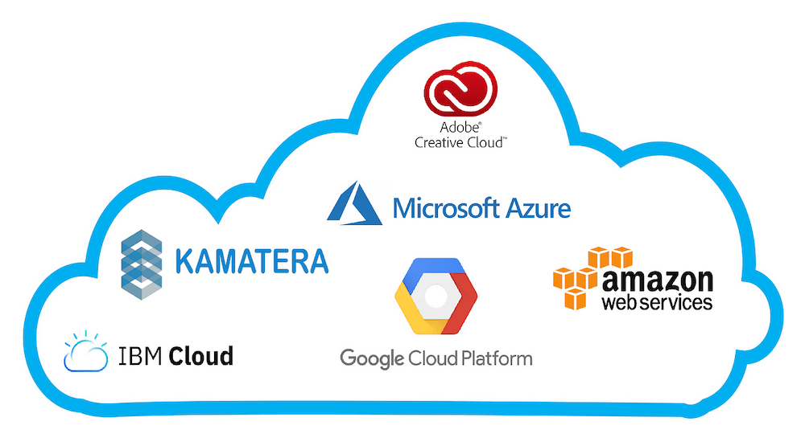

### Cloud Computing

**Definition**: Cloud computing is the delivery of various computing services over the internet (the "cloud"). These services include servers, storage, databases, networking, software, analytics, and intelligence. Instead of owning and maintaining physical data centers and servers, organizations can rent access to these services from a cloud provider, allowing for greater flexibility, scalability, and cost-effectiveness.

{fig-align="center"}

**Key Characteristics**:
1. **On-Demand Self-Service**: Users can provision computing resources as needed automatically without requiring human interaction with the service provider.
2. **Broad Network Access**: Services are available over the network and can be accessed through standard mechanisms, promoting use across various platforms (e.g., mobile phones, tablets, laptops).
3. **Resource Pooling**: The provider's computing resources are pooled to serve multiple consumers using a multi-tenant model, with different physical and virtual resources dynamically assigned and reassigned according to demand.
4. **Rapid Elasticity**: Resources can be elastically provisioned and released to scale rapidly outward and inward commensurate with demand.
5. **Measured Service**: Cloud systems automatically control and optimize resource use by leveraging a metering capability at some level of abstraction appropriate to the type of service.

### Types of Cloud Computing

{fig-align="center"}

1. **Public Cloud**: Services are delivered over the public internet and shared across multiple organizations. Examples include:
   - **Amazon Web Services (AWS)**: Offers a wide range of services, including computing power (EC2), storage (S3), and databases (RDS).
   - **Microsoft Azure**: Provides services like virtual machines, app services, and databases.
   - **Google Cloud Platform (GCP)**: Offers services such as Google Compute Engine, Google Cloud Storage, and BigQuery.

2. **Private Cloud**: Services are maintained on a private network and are dedicated to a single organization. This model provides more control and security. Examples include:
   - **VMware vSphere**: A platform for building and managing private clouds.
   - **OpenStack**: An open-source platform for creating and managing private clouds.

3. **Hybrid Cloud**: Combines public and private clouds, allowing data and applications to be shared between them. This model provides greater flexibility and optimization of existing infrastructure. Examples include:
   - **Microsoft Azure Stack**: Allows organizations to run Azure services in their own data centers.
   - **AWS Outposts**: Extends AWS infrastructure and services to on-premises environments.

4. **Multi-Cloud**: Involves using multiple cloud services from different providers to avoid vendor lock-in and enhance redundancy. For example, a company might use AWS for storage, Google Cloud for machine learning, and Azure for application hosting.

### Examples of Cloud Computing Applications

1. **Data Storage and Backup**:
   - **Dropbox**: A cloud-based file storage service that allows users to store and share files online.
   - **Google Drive**: Provides cloud storage and file synchronization services.

2. **Software as a Service (SaaS)**:
   - **Salesforce**: A cloud-based customer relationship management (CRM) platform.
   - **Microsoft 365**: Offers cloud-based productivity applications like Word, Excel, and Outlook.

3. **Infrastructure as a Service (IaaS)**:
   - **Amazon EC2**: Provides scalable computing capacity in the cloud, allowing users to run virtual servers.
   - **Google Compute Engine**: Offers virtual machines that run in Google’s data centers.

4. **Platform as a Service (PaaS)**:
   - **Heroku**: A platform for building, running, and operating applications entirely in the cloud.
   - **Google App Engine**: A platform for developing and hosting web applications in Google-managed data centers.

5. **Big Data and Analytics**:
   - **Amazon Redshift**: A cloud data warehouse service that allows users to run complex queries and analyze large datasets.
   - **Google BigQuery**: A fully managed data warehouse that enables super-fast SQL queries using the processing power of Google’s infrastructure.

6. **Machine Learning and AI**:
   - **AWS SageMaker**: A service that provides tools to build, train, and deploy machine learning models.
   - **Google AI Platform**: Offers tools and services for building and deploying machine learning models.