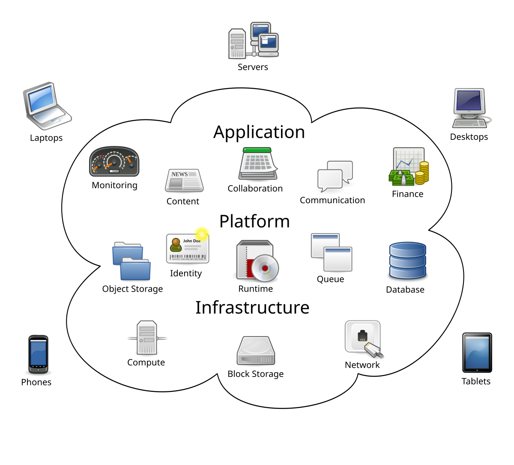
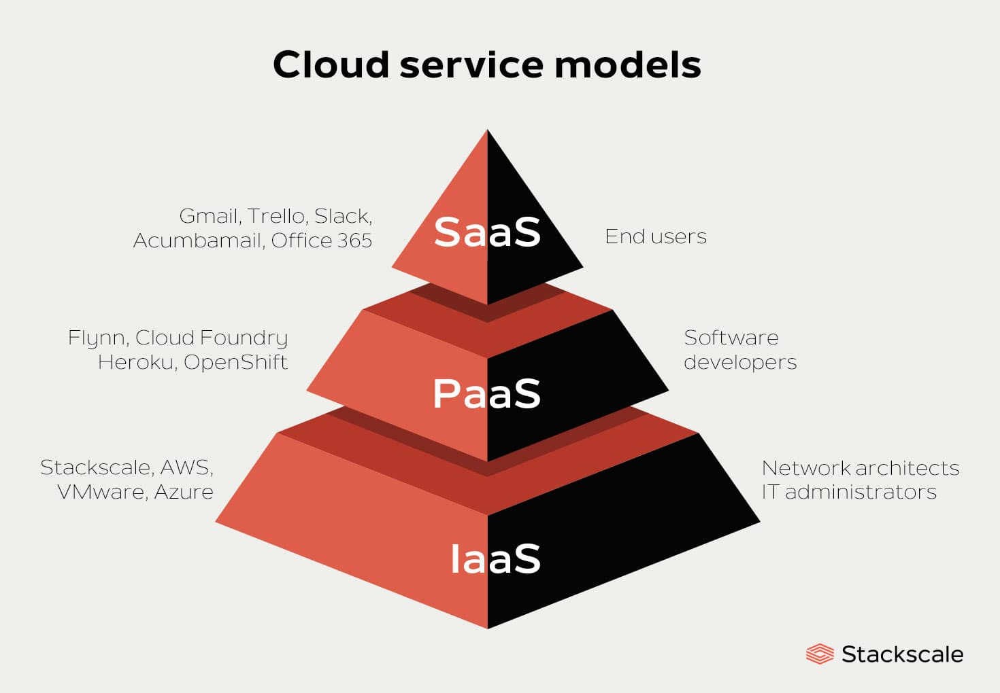
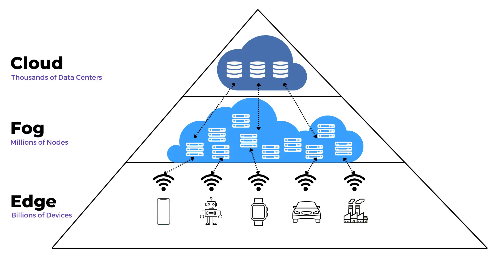
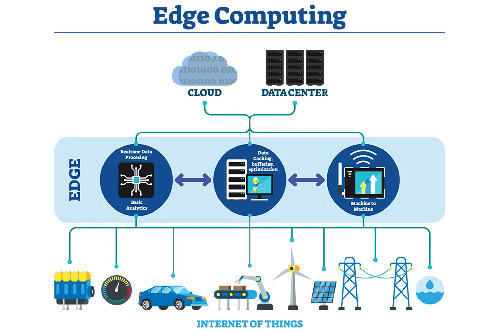
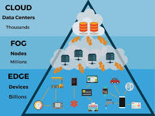

## Agenda

- Introduce Cloud, Fog, and Edge computing
- Explain various cloud service models
- Case study involving the choice of service models
- Edge computing
- Why choose Edge over Cloud
- How Fog computing can bridge Edge and Cloud
- Conclusion
- Q&A

## The Growing Pains of FreshBake Bakery

- FreshBake Bakery is a small but rapidly expanding business with **10 physical stores** in Vancouver. 
- They currently **host** their website, inventory system, and customer loyalty program on an aging **on-premise** server. 
- During **peak holiday seasons**, their website crashes due to traffic spikes, inventory updates lag, and IT maintenance costs are eating into profits. 
- The owner wants to **scale operations**, **improve customer experience**, and **reduce IT headaches** but lacks technical expertise.
- Your group is a tech advisory team hired by FreshBake. 
- Analyze their challenges and propose solutions.  

{fig-align="center"}

## The Growing Pains of FreshBake Bakery

1. What are the key business outcomes *negatively* affected by the current digital infrastucture of the company?
2. Propose a solution for the company outlining:
   1. First steps
   2. Transformation
   3. Expected improvements in outcomes
 
{fig-align="center"}

## What is Cloud Computing?  
- Cloud computing delivers **on-demand computing services**: 
    - storage, 
    - software, 
    - processing power
- over the internet. 
- Instead of owning physical servers, companies **rent resources** from cloud providers like AWS, Microsoft Azure, or Google Cloud.  

{fig-align="center"}

## Key Characteristics of Cloud Computing  

1. **Scalability**  
   - Resources can be scaled **up** or **down** based on demand.  
   - E-commerce platforms handle **traffic spikes** during sales.  

2. **Cost-Effectiveness**  
   - Reduces capital expenses by eliminating the need for **in-house hardware**.  
   - Pay only for what you use ("**pay-as-you-go**" model)

## Key Characteristics of Cloud Computing  

3. **Accessibility**  
   - Services are accessible from **anywhere** with an internet connection.  

4. **Flexibility and Innovation**  
   - Supports **rapid deployment** of applications and services, fostering **innovation**.  

## Airbnb

- **Scenario:** Airbnb hosts millions of listings worldwide, requiring scalable infrastructure to handle **fluctuating demand**.  
- **Solution:** Airbnb uses AWS EC2 to:  
  - Scale server capacity during **peak travel seasons**.  
  - Reduce **infrastructure costs** by only paying for what they use.  
  - Ensure **high availability** for its global user base.  

{fig-align="center"}

## Cloud Service Models  

1. **Infrastructure as a Service (IaaS):**  
   - Provides virtualized computing resources (e.g., servers, storage).  
   - Example: AWS EC2.  

{fig-align="center"}

## **Amazon Web Services (AWS) EC2**  

- **Amazon Elastic Compute Cloud (EC2)** is a prominent IaaS offering that allows businesses to **rent virtual servers** for their computing needs.  

{fig-align="center"}

## Discussion Question

- Imagine your group is advising a company considering migrating its on-premise IT infrastructure to an IaaS provider (e.g., AWS, Azure, Google Cloud). Each group will be assigned a specific industry:
   - healthcare, 
   - e-commerce, 
   - government, 
   - education.

## Discussion Question

- What are the top 3 factors (e.g., cost, scalability, security, compliance, latency) your assigned industry should prioritize when selecting an IaaS provider? Justify your choices.
- What unique challenges might this industry face in adopting IaaS, and how could they mitigate them?
- Draft a shortlist of best practices for ensuring a smooth transition to IaaS, tailored to your industry’s needs.
   - Each group will present their recommendations. 
   - The class will then discuss: 
      - Are there universal IaaS adoption principles across industries, or do priorities fundamentally differ?

## Snapchat  
- **Scenario:** Snapchat needed a platform to support rapid user growth and enable its engineers to **focus on app development** (company's main focus) rather than server management.  
- **Solution:** Snapchat used Google App Engine to:  
  - **Deploy its app quickly** without worrying about server provisioning.  
  - **Automatically scale** resources as its user base expanded.  
  - Simplify **backend management** with integrated tools and APIs.  

{fig-align="center"}

## Cloud Service Models  

2. **Platform as a Service (PaaS):**  
   - Offers tools and platforms for developers to build applications.  
   - Google App Engine.  

{fig-align="center"}

## Google App Engine (GAE) 

- **Google App Engine (GAE)** is a PaaS that enables developers to **build, deploy, and scale** applications without managing the **underlying infrastructure**.  

{fig-align="center"}

## Cloud Service Models  

3. **Software as a Service (SaaS):**  
   - Delivers **fully functional applications** over the internet.  
        - Salesforce, 
        - Microsoft Office 365.  

{fig-align="center"}

## Salesforce CRM  

- **Salesforce** is a leading SaaS platform offering Customer Relationship Management (CRM) tools that help businesses **manage customer interactions**, **sales**, and **marketing activities**.  

{fig-align="center"}

## Use Case: Coca-Cola Enterprises  

- **Scenario:** Coca-Cola Enterprises needed a centralized solution to **manage sales** processes across its global workforce.  
- **Solution:** By adopting Salesforce CRM, Coca-Cola was able to:  
  - Provide *sales teams* with **real-time access** to customer data from any device.  
  - Streamline customer engagement and improve **collaboration across departments**.  
  - **Analyze customer behavior** and generate insights to *optimize marketing strategies*.

{fig-align="center"}

## Benefits of Cloud Computing  

1. **Agility and Speed**  
   - Companies can quickly **adapt** to changes and deploy solutions faster.  

2. **Reduced IT Overhead**  
   - Outsourcing **infrastructure management** to cloud providers.  

## Business Benefits of Cloud Computing  

3. **Enhanced Collaboration**  
   - Everything is on the web
   - Teams can work together using shared tools and resources.  
   - Develop using various devices and places

4. **Global Reach**  
   - Cloud data centers allow companies to operate globally with **low latency**.  

## Risks and Challenges  

1. **Security Concerns:**  
   - **Data breaches** and **unauthorized access** can occur if not managed properly.  

2. **Dependence on Providers:**  
   - **Outages from providers** can disrupt operations.  

3. **Cost Management:**  
   - Poorly managed usage can lead to **unexpected expenses**.  

## Discussion Question  

- How has Netflix leveraged cloud computing to transform its global streaming service?
- Consider **scalability**, **content delivery**, and **customer experience** in your answer.

## The Real-Time Dilemma at HealthGuard Hospital

- HealthGuard Hospital uses IoT-enabled wearable devices to monitor patients’ vital signs (e.g., heart rate, oxygen levels) in real time. 
- Currently, all data from these devices is sent to a centralized cloud server for processing. 
- However, during emergencies, doctors experience **delays in alerts**, and network congestion during peak hours causes critical data to arrive too late. 
- The hospital also struggles with **sky-high bandwidth costs** and security concerns due to transmitting vast amounts of sensitive patient data. 
- They want to improve response times, reduce costs, and ensure reliable care without compromising patient privacy.  

{fig-align="center"}

## Discussion Question (Group Activity)

- Your group is a tech innovation team tasked with advising HealthGuard. 
- Analyze their challenges and propose a solution to transform their operations.  
1. What are the **key drawbacks** of relying solely on a centralized cloud for real-time patient monitoring?  
2. Which **3 core benefits of edge computing** (e.g., reduced latency, bandwidth optimization, data privacy, offline operation) would most directly address the hospital’s needs? Justify your choices.  
3. What **practical steps** should the hospital take to implement edge computing? Consider hardware/software needs, hybrid cloud-edge integration, and staff training. 

{fig-align="center"}

## What is Edge Computing?  

- **Edge computing** processes data **close to its source**, 
    - IoT devices 
    - local servers
- instead of relying on **centralized cloud data centers**. 
- reduces **latency**, 
- minimizes **bandwidth usage**, 
- enables **faster decision-making**
- for **time-sensitive** applications.  

{fig-align="center"}

## Edge Computing  

1. **Proximity to Data Source**  
   - Data is processed **at or near** the device generating it, reducing delays.  

2. **Low Latency**  
   - Critical for **real-time operations** 
        - autonomous vehicles 
        - industrial automation.  

## Edge Computing  

3. **Bandwidth Optimization**  
   - **Less data** is sent to the cloud, 
   - saving **costs** 
   - reducing **internet congestion**.  

4. **Reliability**  
   - Systems can continue to function even with **limited** or **no internet** connectivity.  

## Edge Computing in Retail  

**Company:** Walmart  
- **Scenario:** Walmart uses IoT sensors and edge computing in its stores to:  
  - **Monitor inventory** in real-time.  
  - **Optimize energy usage** for refrigeration and lighting systems.  
  - Process **customer data locally** for personalized shopping experiences.  

## Running a Factory

- Imagine you are managing a factory.
- It has dozens of machines operating simultaneously.
- Each machine produces sensor data about its speed, components, and production
- The data needs to be analyzed in real time to derive key business insights.
- Propose a computing model for the factory.
- Discuss the pros and cons of your model.

{fig-align="center"}

## Fog Computing

- **Fog computing** is a **decentralized** computing model that extends cloud computing by bringing data processing closer to the network's edge. 
- It bridges the gap between **cloud computing** (centralized) and **edge computing** (localized), enabling more efficient and scalable data processing across distributed systems.

{fig-align="center"}

## Key Characteristics of Fog Computing  

1. **Intermediate Layer**  
   - Sits between edge devices and the cloud, handling data **locally** but still connecting to the cloud for large-scale analysis.  

2. **Distributed Processing**  
   - Data is processed across multiple **fog nodes** (e.g., **routers**, gateways) within the network (i.e. local network).  

## Key Characteristics of Fog Computing  

3. **Scalability**  
   - Can handle large volumes of data from multiple IoT devices without **overwhelming the cloud**.  

4. **Supports Real-Time Applications**  
   - Offers low-latency processing for applications like **smart cities** and **industrial IoT**.  

## Fog Computing in Smart Cities  

**Company:** Cisco  
- **Scenario:** Cisco enables smart cities to use fog computing for applications like:  
  - Managing *traffic lights* based on **real-time traffic** conditions.  
  - Processing *surveillance camera* data locally for faster **threat detection**.  
  - Enhancing *energy efficiency* through real-time **monitoring of utilities**.  

## Conclusion

- Introduction to Cloud, Fog, and Edge computing
- Cloud service models (IaaS, PaaS, SaaS)
- IaaS in different industries
- Edge, Fog, and Cloud, and how to combine them effectively

# Q&A

