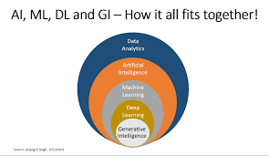
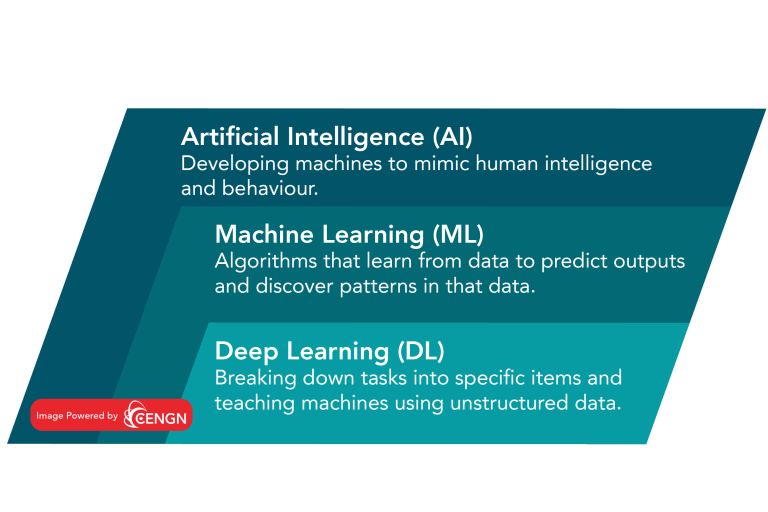

{fig-align="center"}

## Key differences between Artificial Intelligence (AI), Machine Learning (ML), and Deep Learning (DL):

*   **AI is the broadest concept, encompassing both ML and DL**. AI aims to create intelligent machines that can perform tasks typically requiring human intelligence, such as problem-solving and decision-making. AI systems can be rule-based, knowledge-based, or data-driven. Examples include virtual assistants, recommendation systems, and self-driving vehicles. 
*   **ML is a subset of AI that focuses on algorithms that can learn from data without relying on rule-based programming**. ML algorithms are used in various applications, including image recognition, speech recognition, natural language processing (NLP), and recommendation systems. ML algorithms can be classified into three main types: supervised learning, unsupervised learning, and reinforcement learning.
    *   Supervised learning involves training algorithms on labeled data, where the desired output is known. For example, an algorithm can be trained to classify images of cats and dogs by being fed labeled images of each.
    *   Unsupervised learning uses unlabeled data, and the algorithms attempt to discover patterns and relationships without explicit guidance. One example is clustering, where an algorithm groups similar data points together based on shared characteristics without being told what the groups represent.
    *   Reinforcement learning involves an agent that learns to interact with an environment and maximize rewards through trial and error.
*   **DL is a subset of ML that utilizes artificial neural networks with multiple layers to learn complex patterns and representations from data**. This hierarchical learning allows DL to handle tasks that traditional ML struggles with, such as image recognition and NLP. DL excels in accuracy when trained with large amounts of data. Some examples of DL include image and video recognition, generative models, and autonomous vehicles.

{fig-align="center"}

**The key difference between ML and DL lies in how the data is presented to the systems**. ML algorithms generally require structured data, while DL networks operate on multiple layers of artificial neural networks and can handle vast amounts of unstructured data. DL algorithms are inspired by the structure and function of the human brain and excel at automatically learning and extracting features from data. 

**While AI seeks to create intelligent systems capable of performing human-like tasks, ML and DL provide the means to achieve this goal by enabling systems to learn from data.**  

