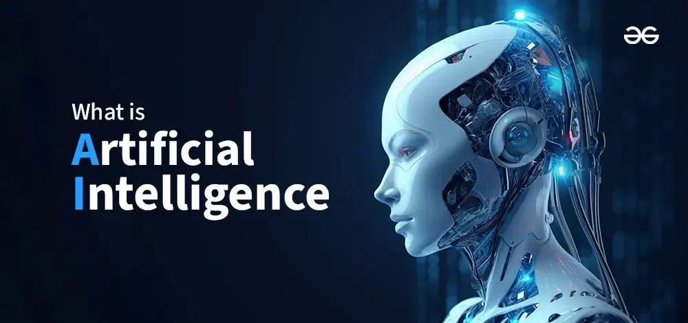

{fig-align="center"}

### 1. **What is Artificial Intelligence?**

**Definition**: 
Artificial Intelligence is the field of computer science focused on creating systems capable of performing tasks that typically require human intelligence. These tasks include reasoning, learning, problem-solving, perception, language understanding, and decision-making.

### 2. **Historical Context**

- **Early Beginnings**: The concept of AI dates back to ancient history, with myths and stories about artificial beings. However, the formal study began in the mid-20th century.
- **1956 Dartmouth Conference**: This event is often considered the birth of AI as a field. Researchers like John McCarthy, Marvin Minsky, and Allen Newell gathered to discuss the potential of machines to simulate human intelligence.
- **AI Winters**: The field has experienced periods of optimism followed by disillusionment, known as "AI winters," where funding and interest waned due to unmet expectations.
- **Resurgence**: The advent of big data, increased computational power, and advancements in algorithms (especially deep learning) have led to a resurgence in AI research and applications in recent years.

### 3. **Types of AI**

AI can be categorized into several types based on capabilities and functionalities:

#### A. **Based on Capabilities**

1. **Narrow AI (Weak AI)**:
   - Designed to perform a specific task (e.g., voice assistants like Siri, recommendation systems).
   - Most AI applications today fall into this category.

2. **General AI (Strong AI)**:
   - Hypothetical AI that possesses the ability to understand, learn, and apply intelligence across a wide range of tasks, similar to a human.
   - This level of AI has not yet been achieved.

3. **Superintelligent AI**:
   - A theoretical form of AI that surpasses human intelligence across all fields, including creativity, problem-solving, and social intelligence.
   - This concept raises ethical and existential questions about control and safety.

#### B. **Based on Functionality**

1. **Reactive Machines**:
   - Basic AI systems that respond to specific inputs with predetermined outputs (e.g., IBM’s Deep Blue chess program).

2. **Limited Memory**:
   - AI systems that can use past experiences to inform future decisions (e.g., self-driving cars that learn from previous driving data).

3. **Theory of Mind**:
   - A more advanced form of AI that understands emotions, beliefs, and intentions of others. This is still largely theoretical.

4. **Self-Aware AI**:
   - The most advanced form of AI that possesses self-awareness and consciousness. This remains speculative and is a topic of philosophical debate.

### 4. **Core Methodologies**

AI employs various methodologies and techniques, including:

- **Rule-Based Systems**: Use predefined rules to make decisions (e.g., expert systems).
- **Machine Learning**: Algorithms that allow systems to learn from data and improve over time.
  - **Supervised Learning**: Learning from labeled data.
  - **Unsupervised Learning**: Finding patterns in unlabeled data.
  - **Reinforcement Learning**: Learning through trial and error, receiving rewards or penalties.
- **Deep Learning**: A subset of ML that uses neural networks with multiple layers to analyze complex data patterns.
- **Natural Language Processing (NLP)**: Techniques that enable machines to understand and generate human language (e.g., chatbots, language translation).
- **Computer Vision**: Techniques that allow machines to interpret and understand visual information from the world (e.g., facial recognition, image classification).

### 5. **Applications of AI**

AI has a wide range of applications across various industries:

- **Healthcare**: AI is used for diagnostics, personalized medicine, drug discovery, and patient management systems.
- **Finance**: Applications include algorithmic trading, fraud detection, credit scoring, and customer service automation.
- **Retail**: AI powers recommendation engines, inventory management, and customer insights.
- **Manufacturing**: AI is used for predictive maintenance, quality control, and supply chain optimization.
- **Transportation**: Self-driving cars, traffic management systems, and logistics optimization.
- **Entertainment**: Content recommendation, game AI, and virtual reality experiences.

### 6. **Challenges and Ethical Considerations**

While AI offers significant benefits, it also presents challenges:

- **Bias and Fairness**: AI systems can perpetuate or amplify biases present in training data, leading to unfair outcomes.
- **Transparency**: Many AI models, especially deep learning, operate as "black boxes," making it difficult to understand their decision-making processes.
- **Job Displacement**: Automation of tasks may lead to job losses in certain sectors, raising concerns about economic inequality.
- **Privacy**: The use of AI in surveillance and data collection raises significant privacy concerns.
- **Safety and Control**: As AI systems become more autonomous, ensuring their safety and alignment with human values becomes critical.

### 7. **Future Prospects**

The future of AI is promising, with ongoing research and development expected to lead to:

- **Enhanced Human-Machine Collaboration**: AI systems will increasingly augment human capabilities rather than replace them.
- **Continued Advancements in Natural Language Processing**: More sophisticated interactions between humans and machines.
- **AI in Creative Fields**: AI-generated art, music, and literature will continue to evolve.
- **Ethical AI Development**: Growing emphasis on creating fair, transparent, and accountable AI systems.

