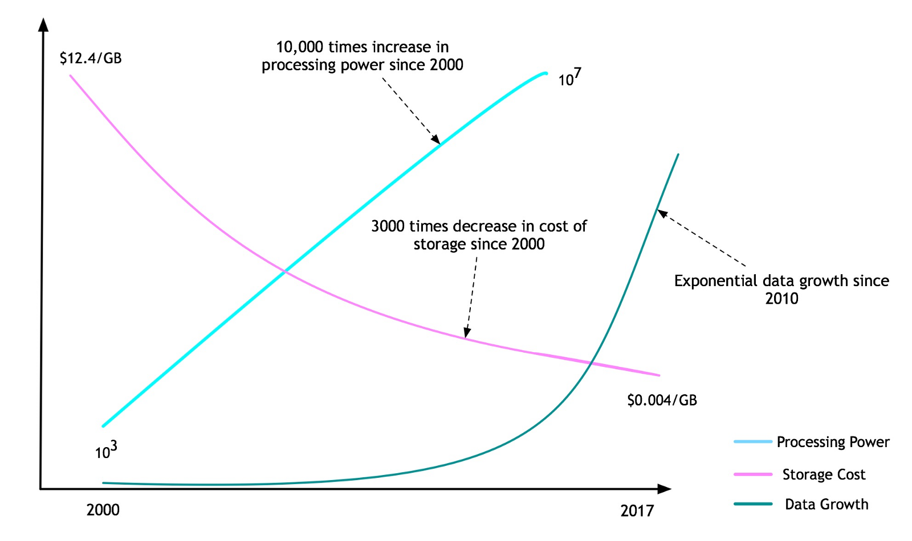
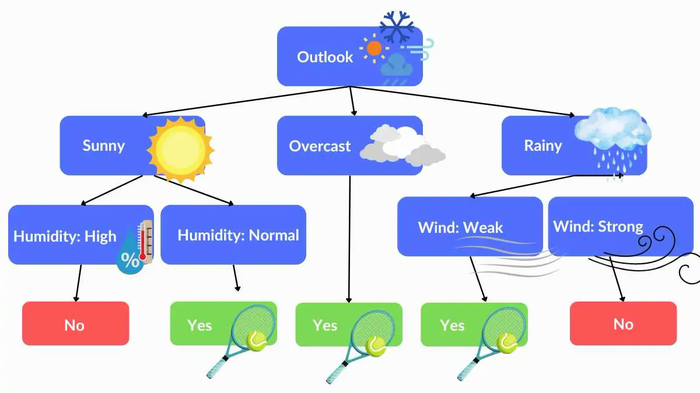
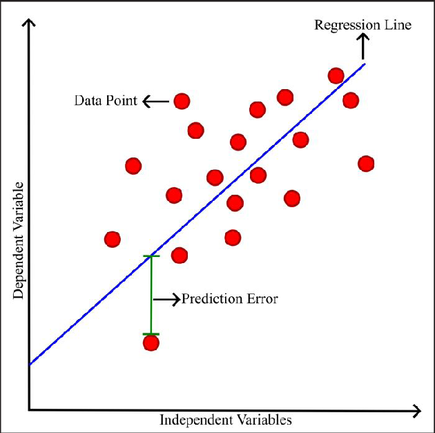
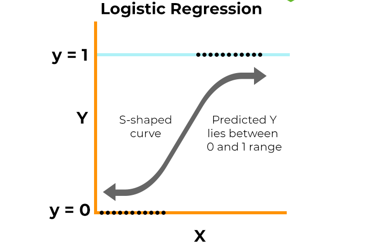
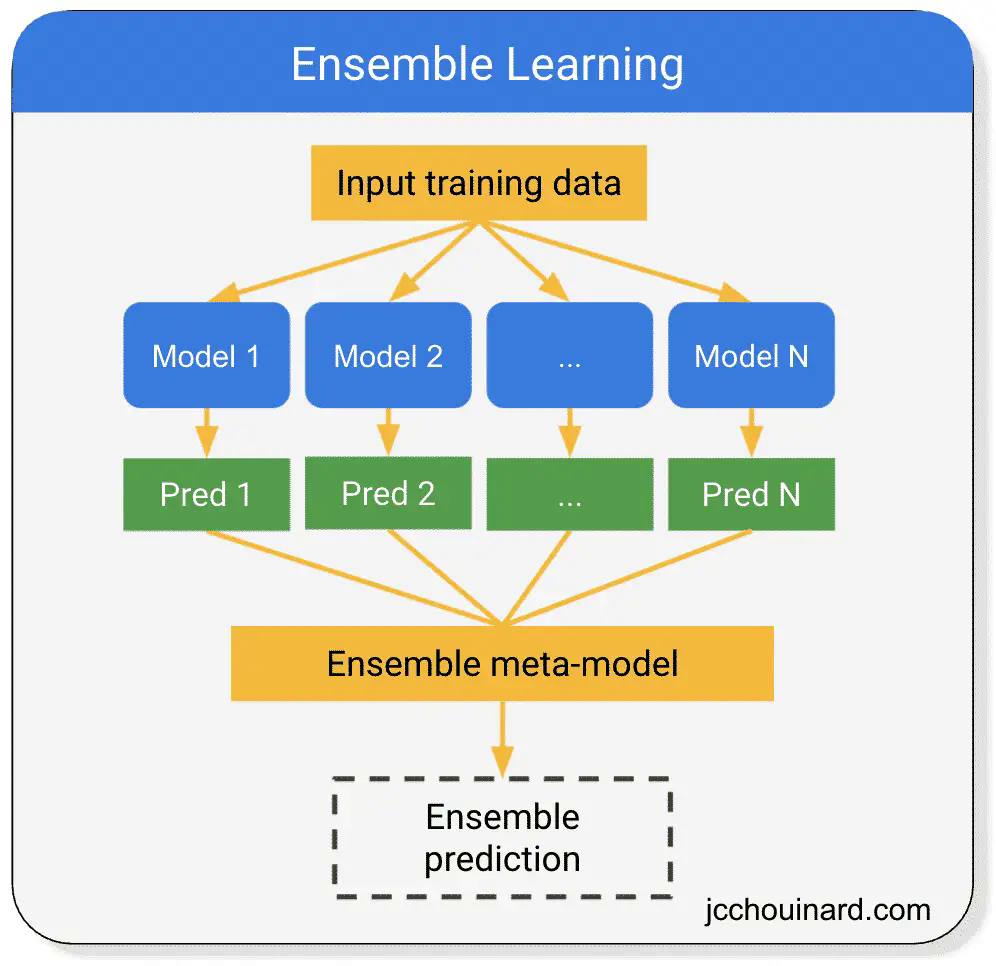
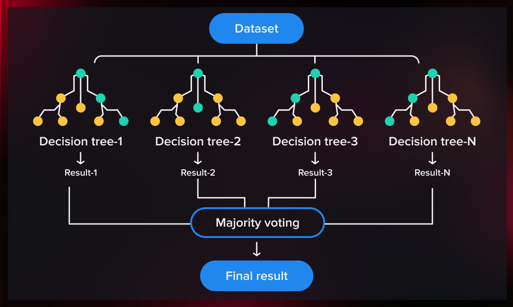

## Agenda

- Review last week's material
- Introduce AI
- Different types of AI
- Machine learning
- ML algorithms
- Different paradigms of learning
- Conclusion
- Q&A

# Review of Last Week

## Discussion

- When you hear ‘Artificial Intelligence,’ what’s the first example that comes to mind?

- Have you interacted with AI today without realizing it? Let’s brainstorm *hidden* AI in daily life.

- How is a ‘smart’ app like ChatGPT different from a basic calculator? What makes it ‘AI’?

## Discussion

- If you asked ChatGPT for advice, would you trust it more than a human? Why or why not?

- What kind of topics do you post on your social media?
- If you trained an AI using only your social media posts, what might it ‘learn’ about people?

## Artificial Intelligence

- **Artificial Intelligence**: Intelligence shown by machines.
- **Intelligence**: 
    - Animal: Instinctual survival behaviors (e.g., birds migrating, bees building hives).
    - Human: Critical thinking, creativity, emotional understanding (e.g., solving complex equations, composing music).
    - Artificial:
        + Pattern recognition (e.g., spam filters, recommendation engines). 
        + Language translation, sentiment analysis (e.g., ChatGPT). 
        + Object detection (e.g., self-driving cars, medical imaging).

{fig-align="center"}

## Artificial Intelligence

- Which one is AI?
    - A computer chess game playing against humans beats a human player. It uses rules-based algorithms to decide its next move.
    - A machine uses historical music listened by you to recommend a new song that you might like.
    - Microsoft Word gives you recommendations on potential spelling errors based on a dictionary.
    - ElevenLabs turns your text into realistic speech. 

{fig-align="center"}

## Machine Learning

- A technique that uses Data and Performance Metric to automatically find how to solve a Task.
- Contrasted with Rules-Based Expert Systems.
- Gained popularity in the 21st century.

## Rise of Machine Learning

- Increase in Compute Power
- Increase in Data (Big Data)
- Decrease in Storage Costs 

{fig-align="center"}

# Machine Learning Algorithms

## Decision Trees

- Imagine you are decision whether to go outside to play tennis.
- To make your decision you use a mentally formed Decision Tree.

{fig-align="center"}

## Linear Regression

- Imagine you have recorded transaction data for a retail store.
- You have the price of the items and their sales.
- You wish to predict sales based on the prices.

{fig-align="center"}

## Logistic Regression

- Imagine you have recorded historical click data for a retail website.
- You have product and customer characteristics in a database.
- You wish to predict whether a given customer will click on the product.

{fig-align="center"}

## Ensemble Learning

- Ensemble learning combines multiple models to improve prediction accuracy, 
- Much like seeking advice from several experts to make a better decision. 
- The idea is that the collective "wisdom" of diverse models reduces individual errors.

{fig-align="center"}

## Ensemble Learning

- *Scenario*: You want to predict if it will rain tomorrow.
- Single Model (Apple Weather):
    - Apple Whether predicts rain with 70% accuracy.
    - If it says "rain," you’re 70% confident.

- Ensemble Approach (Apple Weather, AccuWeather, Google Weather):
    - Three apps, each with 70% accuracy, make independent predictions.
    - Possible outcomes:
        + All three say "rain" → Ensemble says "rain."
        + Two say "rain," one says "no rain" → Majority vote → "rain."
        + If only one says "rain," ensemble says "no rain."

{fig-align="center"}

## Random Forest

### Random Forest

- Random Forest is an ensemble learning algorithm that combines multiple decision trees to improve predictive accuracy and control overfitting. It is widely used for both classification and regression tasks.

- **Ensemble Method**: Builds a "forest" of decision trees, each trained on a random subset of the data and features.
- **Diversity**: Each tree is trained independently, leading to diverse models that capture different patterns in the data.
- **Voting/Averaging**: For classification, the most common predicted class from the trees is chosen; for regression, the average prediction is taken.
- **Robustness**: Reduces overfitting by averaging multiple trees, providing a more generalized model.

- **Advantages:**
    - High accuracy and performance.
    - Handles large datasets with higher dimensionality well.
    - Provides feature importance scores, aiding interpretability.

{fig-align="center"}

## Supervised vs. Unsupervised Learning

- **Supervised Learning**: Algorithms learn from **labeled data**, where each input example is paired with a corresponding output (target). The model aims to map inputs to outputs for prediction or classification.
    - Example: Customer classification into hedonic vs. utility consumers

- **Unsupervised Learning**: Algorithms analyze **unlabeled data** to discover hidden patterns, groupings, or structures without predefined outcomes.
    - Example: Customer segmentation without having any labels

## Supervised vs. Unsupervised Learning

- **Supervised**:  
  - Predicting house prices (regression).  
  - Classifying emails as spam vs. not spam.  
  - Medical diagnosis (e.g., identifying diseases from symptoms).  

## Supervised vs. Unsupervised Learning

- **Unsupervised**:  
  - Customer segmentation (clustering).  
  - Topic modeling in text data (e.g., LDA).  
  - Reducing features in a dataset (PCA for visualization).  

##  Popular Algorithms

- **Supervised**:  
  - Linear Regression, Decision Trees, Support Vector Machines (SVM), Neural Networks.  
- **Unsupervised**:  
  - K-Means Clustering, Hierarchical Clustering, Principal Component Analysis (PCA), Autoencoders.  

## When to Use

- **Supervised**: When you have labeled data and a clear prediction goal (e.g., forecasting sales).  
- **Unsupervised**: For exploratory analysis, anomaly detection, or preprocessing data (e.g., grouping genes by expression).  

## Challenges

- **Supervised**: Requires high-quality labeled data (time-consuming/costly to acquire). Risk of overfitting.  
- **Unsupervised**: Results can be subjective; harder to evaluate without ground truth.  

## Supervised vs. Unsupervised Learning

| **Aspect**              | **Supervised Learning**                          | **Unsupervised Learning**                     |
|-------------------------|--------------------------------------------------|-----------------------------------------------|
| **Data**                | Labeled (inputs + known outputs)                 | Unlabeled (inputs only)                       |
| **Goal**                | Predict outcomes or classify new data            | Explore data structure, find patterns         |
| **Feedback**            | Direct feedback (errors are corrected via labels)| No feedback; model infers patterns autonomously|
| **Common Tasks**        | Regression, Classification                       | Clustering, Dimensionality Reduction          |
| **Evaluation Metrics**  | Accuracy, Precision, Recall, F1-Score, RMSE      | Silhouette Score, Elbow Method, Reconstruction Error |

## Case Studies: Supervised vs. Unsupervised Learning

- Test your understanding by classifying these scenarios into Supervised vs. Unsupervised Learning

## **Case 1**  

- *A company wants to predict customer churn (whether a customer will stop using their service) based on usage patterns and demographics. They have historical data showing which customers churned in the past.*  
- **Answer**: Supervised Learning  
- **Why?** The model uses labeled data (past churn outcomes) to learn patterns and predict future churn.  

## **Case 2**  

- *A biologist has gene expression data from 1,000 patients but no prior labels. They want to group patients into clusters to identify potential subtypes of a disease.*  
- **Answer**: Unsupervised Learning  
- **Why?** No predefined labels exist; the goal is to discover hidden patterns (disease subtypes) in the data.  

## **Case 3**  

- *A streaming service uses viewing history to recommend movies by predicting how users will rate films they haven’t seen yet. They use past user ratings as training data.*  
- **Answer**: Supervised Learning  
- **Why?** The model learns from labeled data (user ratings) to predict future ratings.  

## **Case 4**  

- *A retail store analyzes purchase histories to find products frequently bought together (e.g., "customers who bought X also bought Y").*  
- **Answer**: Unsupervised Learning  
- **Why?** The goal is to discover associations in unlabeled transaction data (no predefined rules or labels).  

## **Case 5**  

- *A weather app predicts tomorrow’s temperature using historical data on temperature, humidity, and wind speed.*  
- **Answer**: Supervised Learning  
- **Why?** The model uses labeled data (historical temperatures) to predict a continuous output (regression).  

## **Case 6**  

- *A photographer uses an algorithm to organize 10,000 unlabeled images into groups of similar landscapes (e.g., beaches, forests, mountains).*  
- **Answer**: Unsupervised Learning  
- **Why?** No labels are provided; the algorithm identifies visual patterns to cluster images.  

## **Case 7**  

- *A bank trains a model to approve or reject loan applications using historical data on applicant income, credit score, and past loan defaults.*  
- **Answer**: Supervised Learning  
- **Why?** The model learns from labeled outcomes (approved/rejected loans) to make decisions.  

## **Case 8**  

- *A researcher reduces a 50-dimensional dataset into 2 dimensions to visualize relationships between data points.*  
- **Answer**: Unsupervised Learning  
- **Why?** Dimensionality reduction (e.g., PCA) uncovers structure in unlabeled data for visualization.  

## **Case 9**  

- *A hospital uses patient data (symptoms, age, medical history) to diagnose whether a patient has diabetes, using records of past diagnoses.*  
- **Answer**: Supervised Learning  
- **Why?** The model is trained on labeled data (past diagnoses) to classify new cases.  

## **Case 10**  

- *A social media platform groups users into communities based on shared interests, without predefined categories.*  
- **Answer**: Unsupervised Learning  
- **Why?** The algorithm identifies natural groupings in unlabeled user behavior data.  

## Conclusion

- Artificial Intelligence definition
- Rules-based AI vs ML
- Decision Trees
- Linear Regression
- Logistic Regression
- Ensemble Learning
- Random Forest
- Supervised vs. Unsupervised learning

## Q&A

### Questions?