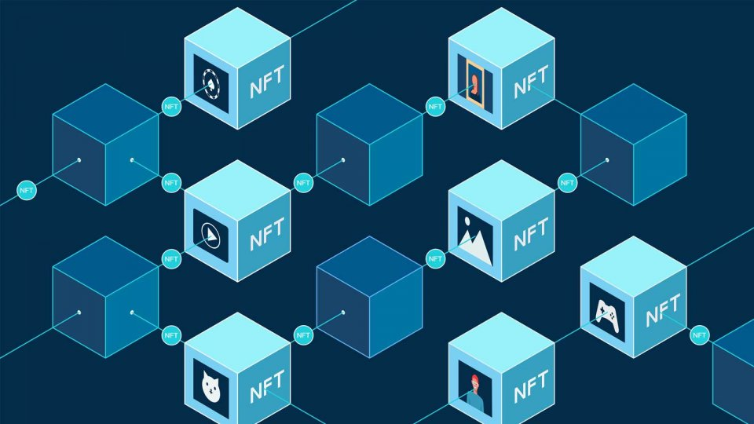

{fig-align="center"}

# 1. **What is Blockchain?**

**Definition**: 
Blockchain is a decentralized, distributed ledger technology that securely records transactions across multiple computers. This ensures that the recorded transactions cannot be altered retroactively without the consensus of the network.

**Key Characteristics**:
- **Decentralization**: Unlike traditional databases that are controlled by a central authority, blockchain operates on a peer-to-peer network, reducing the risk of a single point of failure.
- **Transparency**: All participants in the network can view the entire transaction history, promoting trust and accountability.
- **Immutability**: Once a transaction is recorded on the blockchain, it cannot be changed or deleted, ensuring data integrity.
- **Security**: Cryptographic techniques are used to secure transactions, making it difficult for unauthorized parties to alter the data.

# 2. **How Does Blockchain Work?**

**Basic Components**:
- **Blocks**: Each block contains a list of transactions, a timestamp, and a reference (hash) to the previous block, forming a chain.
- **Nodes**: Computers in the network that validate and store copies of the blockchain.
- **Consensus Mechanisms**: Protocols that ensure all nodes agree on the validity of transactions. Common mechanisms include:
  - **Proof of Work (PoW)**: Requires nodes to solve complex mathematical problems to validate transactions (used by Bitcoin).
  - **Proof of Stake (PoS)**: Validators are chosen based on the number of coins they hold and are willing to "stake" as collateral.

**Transaction Process**:
1. A transaction is initiated and broadcast to the network.
2. Nodes validate the transaction using consensus mechanisms.
3. Once validated, the transaction is grouped with others into a block.
4. The new block is added to the existing blockchain, and all nodes update their copies.

# 3. **Types of Blockchain**

- **Public Blockchains**: Open to anyone, allowing anyone to participate in the network (e.g., Bitcoin, Ethereum).
- **Private Blockchains**: Restricted access, typically used by organizations for internal purposes (e.g., Hyperledger).
- **Consortium Blockchains**: Controlled by a group of organizations, combining elements of both public and private blockchains (e.g., R3 Corda).

# 4. **Business Applications of Blockchain**

**1. Supply Chain Management**:
   - **Transparency**: Track the provenance of goods, ensuring authenticity and reducing fraud.
   - **Efficiency**: Streamline processes by reducing paperwork and intermediaries.

**2. Financial Services**:
   - **Cross-Border Payments**: Facilitate faster and cheaper international transactions.
   - **Smart Contracts**: Automate and enforce contract terms without intermediaries, reducing costs and risks.

**3. Identity Verification**:
   - **Digital Identity**: Securely store and verify identities, reducing identity theft and fraud.

**4. Healthcare**:
   - **Patient Records**: Securely share patient data among healthcare providers while maintaining privacy and compliance.

**5. Real Estate**:
   - **Property Transactions**: Simplify the buying and selling process by using smart contracts to automate title transfers and reduce fraud.

# 5. **Challenges and Considerations**

- **Scalability**: Many blockchain networks face challenges in handling a high volume of transactions quickly.
- **Regulatory Issues**: The legal status of blockchain and cryptocurrencies varies by jurisdiction, creating uncertainty.
- **Energy Consumption**: Some consensus mechanisms, like PoW, require significant energy, raising environmental concerns.
- **Interoperability**: Different blockchains may not easily communicate with each other, limiting their potential.

# 6. **Future of Blockchain**

- **Integration with Other Technologies**: Blockchain is increasingly being combined with AI, IoT, and big data to create more robust solutions.
- **Adoption Across Industries**: As awareness grows, more industries are exploring blockchain for various applications, from finance to healthcare to government.
- **Evolving Regulations**: As governments and regulatory bodies develop frameworks for blockchain, businesses will need to adapt to comply with new laws.

# Applications of Blockchain in Business

1. **Supply Chain Management**: Blockchain can enhance transparency and traceability in supply chains. It allows businesses to track the movement of goods in real-time, verify the authenticity of products, and reduce fraud. Companies like Walmart and IBM have implemented blockchain solutions to improve their supply chain operations.

2. **Financial Services**: Blockchain is revolutionizing the financial sector by enabling faster and cheaper cross-border payments, reducing transaction costs, and increasing security. Cryptocurrencies and decentralized finance (DeFi) platforms are examples of how blockchain is being used in finance.

3. **Smart Contracts**: These are self-executing contracts with the terms of the agreement directly written into code. They automate processes and reduce the need for intermediaries, making transactions more efficient. Industries such as real estate, insurance, and legal services are exploring smart contracts.

4. **Identity Verification**: Blockchain can provide secure and decentralized identity management solutions. This is particularly useful for KYC (Know Your Customer) processes in banking and finance, as well as for verifying identities in online services.

5. **Healthcare**: Blockchain can improve the management of medical records, ensuring that patient data is secure, accessible, and tamper-proof. It can also facilitate the tracking of pharmaceuticals to combat counterfeit drugs.

6. **Voting Systems**: Blockchain can enhance the security and transparency of voting processes, making it easier to verify results and reduce the risk of fraud. This application is being explored for both governmental elections and corporate governance.

7. **Intellectual Property Protection**: Blockchain can help artists and creators protect their intellectual property rights by providing a secure and immutable record of ownership and usage rights.

8. **Real Estate**: Blockchain can streamline property transactions by providing a transparent and secure way to record ownership, transfer titles, and manage leases. This can reduce fraud and lower transaction costs.

9. **Energy Trading**: Blockchain can facilitate peer-to-peer energy trading, allowing consumers to buy and sell excess energy generated from renewable sources directly with one another, thus promoting sustainability.

10. **Loyalty Programs**: Businesses can use blockchain to create more flexible and interoperable loyalty programs, allowing customers to earn and redeem points across different platforms and retailers.

11. **Insurance**: Blockchain can automate claims processing and underwriting through smart contracts, improving efficiency and reducing fraud. It can also provide a transparent record of policyholder information.

12. **Crowdfunding and Fundraising**: Blockchain enables new models of fundraising, such as Initial Coin Offerings (ICOs) and Security Token Offerings (STOs), allowing startups to raise capital in a decentralized manner.

13. **Data Security and Privacy**: Businesses can use blockchain to secure sensitive data and ensure privacy through decentralized storage solutions, reducing the risk of data breaches.

14. **Decentralized Autonomous Organizations (DAOs)**: These are organizations governed by smart contracts on the blockchain, allowing for decentralized decision-making and management.

