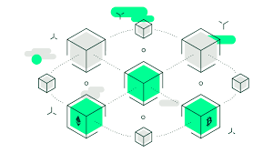
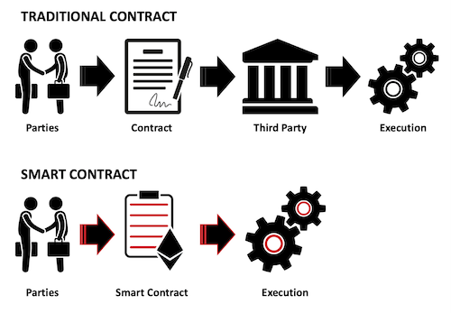
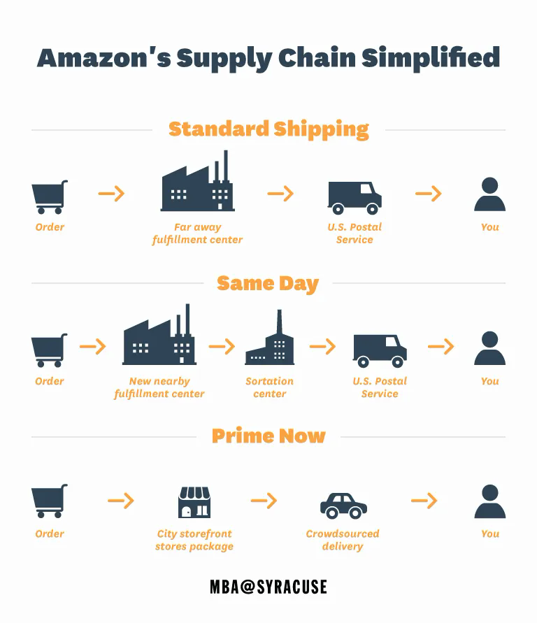
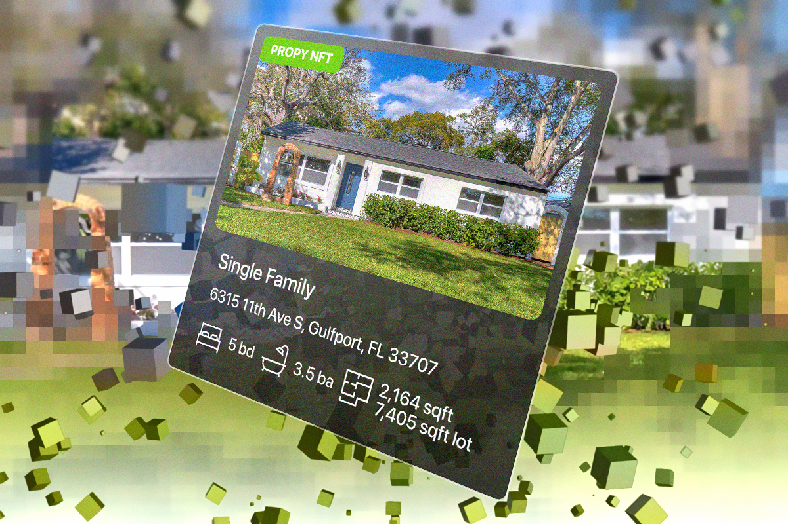
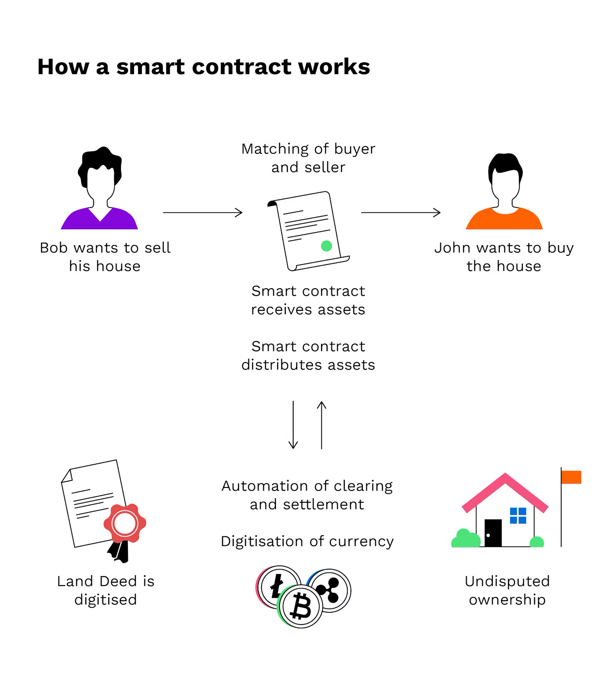
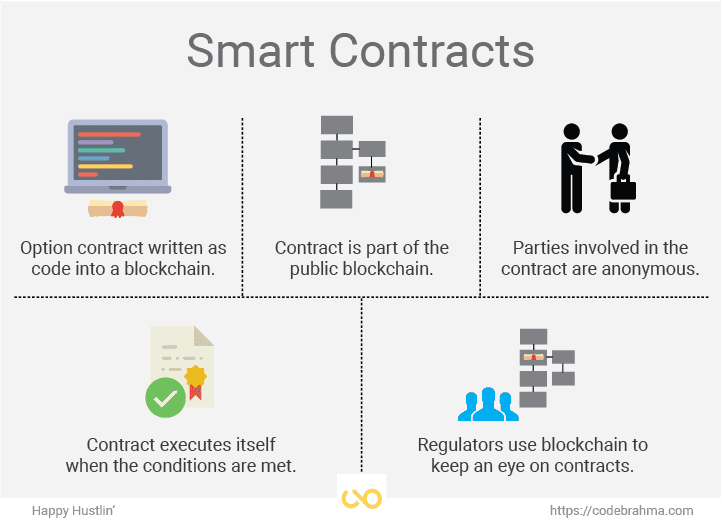
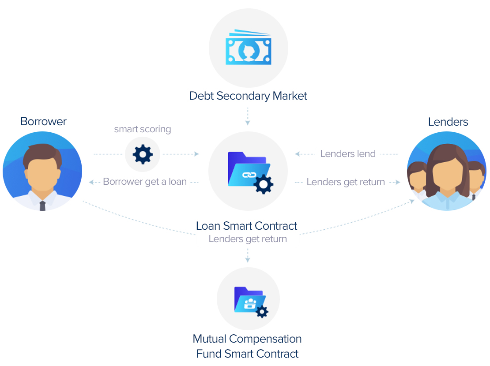
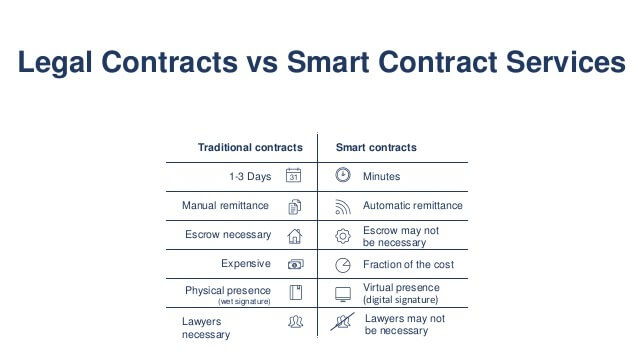

## Blockchain Technology

{fig-align="center"}

## Agenda

- Blockchain definition
- Smart Contracts
- Business use cases of blockchain and smart contracts

## Discussion Questions

- How can we ensure that our digital transactions are secure and that the products we buy are genuine?

- What are some situations where having a shared, unalterable record would be beneficial?

- What if you could eliminate the need for intermediaries in your business dealings? How would that change the way you operate?

- How can we ensure that all parties involved in a transaction agree on the details and that there's no dispute later on?

## Blockchain

- Blockchain is a digital system that records information 
    - **securely**, 
    - **transparently**, 
    - in a way that's **difficult to alter**.

{fig-align="center"}

## Why Does Blockchain Matter?

- **Security**: Ensures the integrity and security of digital transactions.
- **Transparency**: Provides a clear and tamper-proof record of all activities.
- **Efficiency**: Streamlines processes by eliminating intermediaries and reducing fraud.

{fig-align="center"}

## Features of Blockchain

- **Decentralized**: No single point of control; data is distributed across a network.
    - Contrast with cloud computing
- **Immutable**: Transactions are permanent and cannot be altered.
- **Consensus**: All parties agree on the validity of transactions.
- **Programmable**: Smart contracts can settle transactions based on complex situations.

{fig-align="center"}

## Smart Contracts

- A smart contract is a self-executing program 
- Contains the terms of an agreement written directly into lines of code. 
- It is stored and replicated on a blockchain.
- Solana, Ethereum, etc.

{fig-align="center"}

## Question

- Come up with a use case for the immutability and programmability of smart contracts
    - Deed management (e.g. real estate, tangible good, digital goods)
    - Legal contracts
    - Voting Systems
    - Intellectual Property Management
    - Crowdfunding
    - Insurance
    - Education

## Smart Contracts in Supply Chain Management

- Traditional Issues in Supply Chain Management
    - Inefficiencies in **tracking** and **monitoring** shipments.
    - Lack of **transparency** leading to mistrust between suppliers and buyers.
    - **Manual** processes causing delays in payments and documentation.

## Smart Contracts in Supply Chain Management

- **Automation**: Automatically trigger actions like payments upon delivery confirmation.
- **Transparency**: Provide real-time tracking and monitoring of shipments.
- **Trust**: Ensure all parties adhere to agreed terms without intermediaries.

## Case Study: Amazon

- Background: 
    - Amazon faces delivery delays and payment issues in their supply chain, affecting supplier relationships and cash flow.

- Implementation: Integrating smart contracts with IoT sensors to monitor shipments and automate payments.

{fig-align="center"}

## Case Study: Amazon

- Process:
    - **Order Placement**: Buyer places an order, triggering a smart contract.
    - **Shipment Tracking**: IoT sensors monitor the shipment and update the blockchain.
    - **Delivery Confirmation**: Upon delivery, the smart contract releases payment to the supplier.
    - **Documentation**: All transactions and terms are recorded immutably on the blockchain.
    - **Post-purchase Services**: Product support, returns, etc.

{fig-align="center"}

## NFTs

- Non-Fungible Tokens
- Popularity and adoption surged in 2021 with celebrity adoption
- Used for status signaling
- Verifiable certificate of ownership

{fig-align="center"}

## Smart Contracts in Real Estate

- If you own a house, how do you prove to others that you are the owner?
- What if somebody forged a deed? What resort do you have?
- What are some of the challenges when you wish to sell your house?

## Smart Contracts in Real Estate

{fig-align="center"}

## Smart Contracts in Real Estate

{fig-align="center"}

## Smart Contracts in Real Estate

| **Feature**                | **Traditional Contracts**                                           | **Smart Contracts**                                               |
|----------------------------|-------------------------------------------------------------------|------------------------------------------------------------------|
| **Execution**              | Manually executed; signed on paper or digital formats.            | Automatically executed when predefined conditions are met.       |
| **Trust Requirement**      | Requires trust in intermediaries (e.g., brokers, attorneys).      | Trust is minimized; relies on blockchain technology for security. |
| **Involvement of Intermediaries** | Often requires multiple intermediaries (lawyers, notaries).   | Reduces or eliminates need for intermediaries, speeding up processes. |
| **Timeframe for Transactions** | Can take weeks or months to complete due to manual processing.  | Can be completed in minutes to hours through automation.         |
| **Cost**                   | Often associated with higher costs due to intermediary fees.       | Lowers costs by minimizing fees related to third parties.        |
| **Dispute Resolution**     | Generally requires legal action or mediation in case of disputes.  | Built-in mechanisms can provide automated dispute resolution.     |
| **Data Security**          | Vulnerable to forgery and data manipulation.                       | High security with immutable records on the blockchain.          |

## Smart Contracts Features

{fig-align="center"}

## Smart Contracts in Financial Services

- Imagine you are planning on buying a home.
- To secure the funds, you explore different mortgage options.
- What challenges you might face when researching the best mortgage option?

## Smart Contracts in Financial Services

- As a car owner, you have car insurance.
- If a collision occurs, what are the steps necessary to receive compensation?
- How can these steps be simplified using blockchain?

## Smart Contracts in Financial Services

- Automate loan disbursements or insurance claims based on predefined conditions.

- Issues of Traditional Systems
    - Costly processes due to manual interventions.
    - Lengthy processing times lead to frustrations among customers.

## Smart Contracts in Financial Services

- Automate Processes:
    - Loan disbursements triggered by conditions such as **credit score** or **document verification**.
    - Insurance claims paid automatically upon verification of **required conditions**.
    - Enhance Transparency: All parties have access to the same information, **reducing disputes**.

{fig-align="center"}

## Smart Contracts in Financial Services

- A bank uses smart contracts to streamline the loan approval process.
- Process:
    - Customer submits loan application.
    - Smart contract verifies identity, credit score, and other conditions.
    - Automatic loan disbursement upon confirmation.
- Outcomes:
    - Reduced processing time from days to minutes.
    - Lower operational costs and less human error.

{fig-align="center"}

## Smart Contracts in Legal Contracts

- You want to create a website for your new startup.
- You are no software engineer, so you decide to hire a web developer.
- How can you create a contract that you and the web dev both agree on?
- When the web dev delivers your website, what potential issues can arise?
- How can you dispute and resolve those issues?

## Smart Contracts in Legal Contracts

- Automate the enforcement of contract terms, reducing the need for legal intervention.

- Complexity and Length:
    - Traditional contracts often include lengthy, convoluted terms open to interpretation.
- Need for Legal Intervention:
    - Many agreements require court involvement for enforcement, resulting in high costs and significant delays.
- Disputes and Misinterpretations:
    - Ambiguity leads to disputes between parties, often necessitating extensive legal processes.

{fig-align="center"}

## Smart Contracts in Legal Contracts

- Automated Transactions:
    - Once predefined conditions are met, the contract executes automatically.
- Examples of Conditions:
    - Payment terms met, delivery confirmation, performance milestones reached, etc.
- Built-in Mechanisms:
    - Automatically resolve disputes through defined algorithms without needing to resort to courts.

{fig-align="center"}

## Smart Contracts in Voting Systems

- What are the issues the in the traditional voting systems?
- How are these issues usually resolved?
- What steps can be taken to mitigate these issues?

## Smart Contracts in Voting Systems

- Ensure transparent and tamper-proof vote counting.

- The Challenge in Traditional Voting Systems
    - Vulnerability to Fraud: Traditional voting methods are susceptible to **ballot tampering**, **miscounts**, and **fraud**.
    - Lack of Transparency: Voters and stakeholders often lack visibility into the vote counting process, undermining trust.
    - Complexity and Inefficiency: Manual counting processes can lead to errors and **delays** in results.
    - Post-Election Disputes: Controversies arise from ambiguous voting procedures and results.

## Smart Contracts in Voting Systems

- Immutable Ledger: Central feature that ensures all votes are recorded and cannot be altered once submitted.
- Decentralization: Distributes data across multiple nodes, reducing the risk of centralized attacks.
- Automated Vote Counting: Smart contracts automatically tally votes once submitted, enabling real-time results.
- Transparent Validation: Each vote can be tracked and verified by all stakeholders, ensuring transparency.
Condition-Based Execution:
- Smart contracts can enforce voting rules and requirements, such as eligibility verification.

## Smart Contracts in Intellectual Property Management

- Imagine you invented a new machine. What are some of the barriers for registering a patent?
- When you upload original content on YouTube, how can you ensure nobody else would steal your content and reupload it?

## Smart Contracts in Intellectual Property Management

- Automate licensing and tracking of intellectual property usage.
- Complexity of Contracts:
    - Licensing agreements often involve complicated terms and conditions.
- Infringement Risks:
    - Difficulty in monitoring unauthorized use or infringement of IP rights.
- Inefficiency in Enforcement:
    - Time-consuming legal processes to enforce rights and collect royalties.

## Smart Contracts in Intellectual Property Management

- Self-executing contracts with the terms directly coded, automatically enforced when conditions are met.
- Immutable records of ownership and rights.
- Who created in IP-protected content **first**.
- Automated enforcement of terms, such as licensing and royalties.

## Other Use Cases of Smart Contracts 

- **Crowdfunding**
    - Automatically release funds to projects upon reaching specified milestones.
- **Donations and Charity**
    - Disaster management: People send funds (Bitcoin) to organizers. Organizers use smart contracts and blockchain to track the purchases made using funds ensuring transparency.
- **Education**
- Automatically issue certificates upon course completion.

## Conclusion

- What are Blockchains?

- What are Smart Contracts?

- What business sectors can benefit from blockchains and smart contracts?

# Questions?