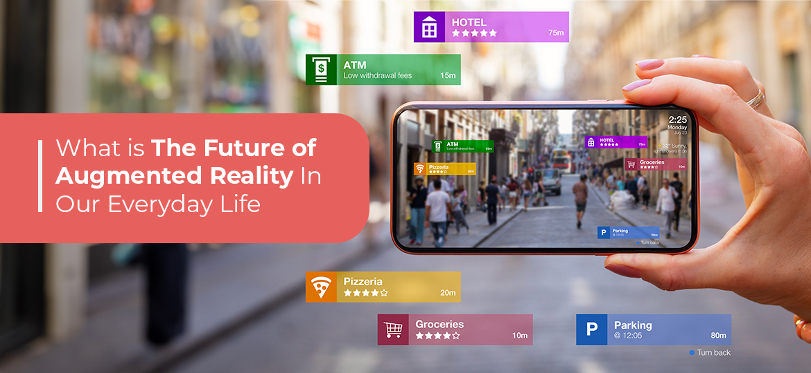
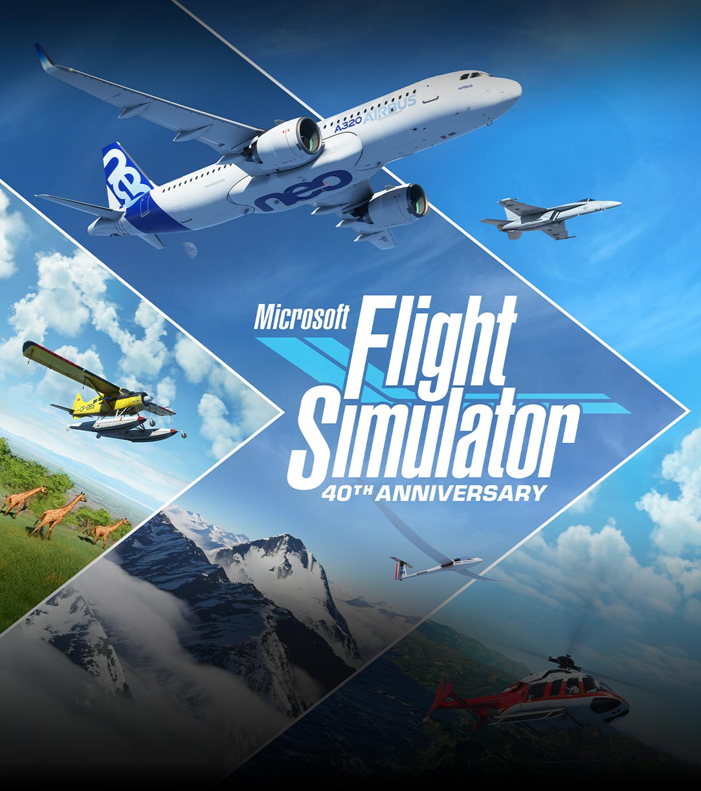
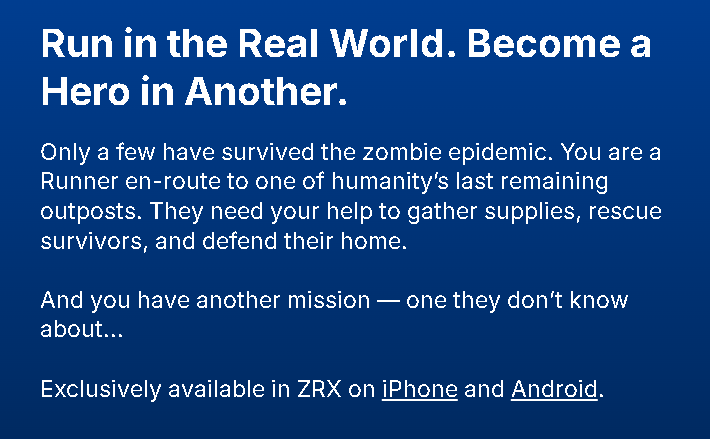
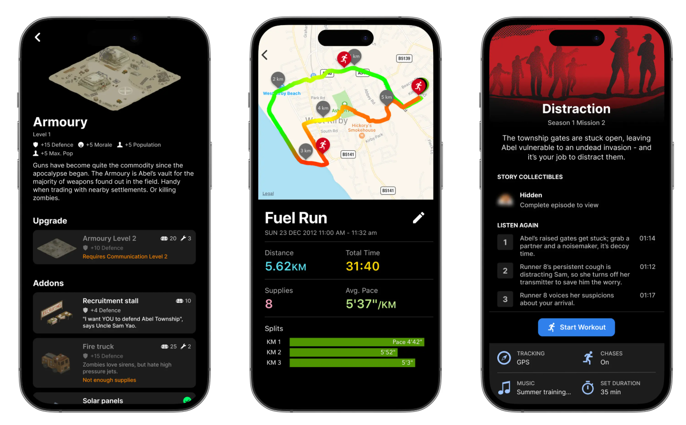
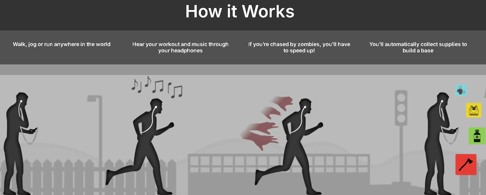
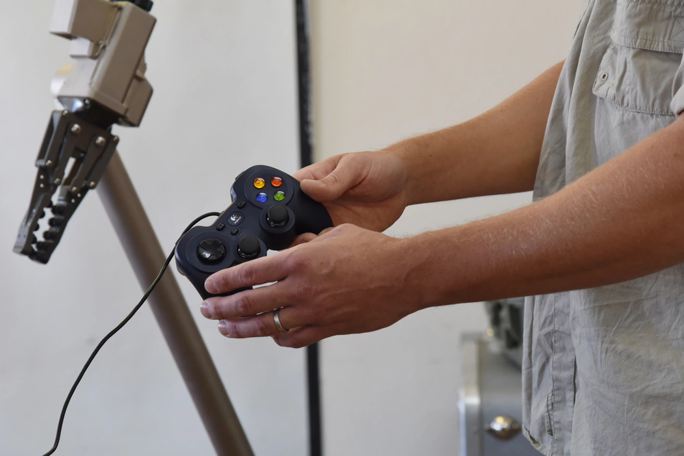

# Review of Last Week

## Agenda
- Immersive Technologies
    - AR
    - VR
- Gamification
- Business Cases
- Ethical Concerns

## Question

- Think of becoming a pilot.
- Why is it deemed a difficult task? Why are there more people with driver's license than with pilot's license?
- "It takes 10,000 hours to become proficient with flying." 
- What solutions do we have to this problem?

{fig-align="center"}

## Immersive technologies

- Immersive technologies: a group of digital tools and techniques that create or enhance **user experiences** 
- **simulating** realistic environments, 
- **interacting** with virtual elements, 
- **blending** digital content with the physical world. 

{fig-align="center"}

## Immersive technologies

1. **Virtual Reality (VR)** 
    - using headsets to create a *fully computer-generated* environment that users can interact with. 
    - In VR, users are completely immersed in a virtual world, typically experienced through visual and auditory stimuli, and sometimes through haptic feedback.

- Research *three* VR hardware. Find what their use cases are. Write the information down and share it with the class.

{fig-align="center"}

## Immersive technologies

2. **Augmented Reality (AR)** 
    - AR **overlays** digital information or objects onto the real world, 
    - enhancing the perception of the surroundings. 
    - Users can view AR content through devices like **smartphones, tablets, or AR glasses**, 
    - allowing for interaction with **both** virtual and physical elements.

- Research *three* AR hardware. Find what their use cases are. Write the information down and share it with the class.

{fig-align="center"}

## Gamification

- Gamification is the application of **game-design** elements, principles, and mechanics in non-game contexts 
- **engage and motivate** individuals to achieve specific goals, enhance user experience, and drive behavior.
- to leverage humans' **natural tendencies** toward *play, achievement, and social interaction*, 
- making tasks feel *more enjoyable and rewarding*.

## Gamification

- Why are people more willing to swipe their phone than sweep their floor?

{fig-align="center"}

## Gamification

1. **Points**: Users earn points for completing tasks, achieving milestones, or participating in activities. Points serve as a measurable form of progress and achievement.

2. **Badges**: Badges are visual representations of accomplishments that users can earn by completing specific tasks or challenges. 
    - They provide *recognition* and can *motivate* further participation.

3. **Leaderboards**: Leaderboards rank participants based on their performance, often fostering healthy competition among users. 
    - This element taps into people's desire for *social comparison and status*.

## Gamification

4. **Challenges and Quests**: Structuring tasks as challenges or quests can create a sense of adventure and engagement. Users may be motivated to complete these tasks to overcome obstacles or unlock rewards.

- Why some people are drawn to challenging games?
- What is the difference between a challenging game and a challenging job? What is a chore?

{fig-align="center"}

## Gamification

5. **Levels and Progression**: Users can advance through levels by completing certain objectives or accumulating points. This system provides a **sense of progression**.

## Progress Bar

- What is the difference between these two progress bars in terms of design?

{fig-align="center"}

## Group Question

- Think about your MBA program.
- Does the two-year completion timelime provide enough **progression** to give you a sense of progression?
- Provide a proposal that would enhance the sense of progression for the students.

## Challenges of Gamification:

- **Overjustification Effect** 
    - Relying too heavily on **extrinsic rewards** can undermine **intrinsic motivation**, leading users to only engage in activities for the *rewards* rather than for personal growth or *enjoyment*.
    - e.g., when you finish a game you tend to enjoy the game world less.
- **Excessive Freedom**
    - An open-world game with no objectives
    - Does it make the game boring?

## The Case of Microsoft Flight Simulator

- Realistic Graphics and Simulated Environments
- Virtual Cockpit Experiences
- VR Support
- Dynamic Weather and Air Traffic
- Community and Multiplayer Features

- [Motion Simulator build and test flight](https://www.youtube.com/watch?v=LPoZx88OQQg)

{fig-align="center"}

## Guitar Hero

- Learning to play a musical instrument can be quite challenging.
- The initial learning curve is steep.
- In the first few months there seems to be little progression.
- Until you get good, nobody wants to listen to your play.
- Introducing Guitar Hero

- [ONE BY METALLICA ~ 150% SPEED ~ FIRST EVER 100% FC!!!!!!!!!!](https://www.youtube.com/watch?v=Fneaa0E6PwE)

{fig-align="center"}

## Video

[Trailer](https://www.youtube.com/watch?v=QXV5akCoHSQ)

## Video

- What do you think this trailer is?
- Zombies, Run!

## Zombies, Run!

{fig-align="center"}

## Zombies, Run!

{fig-align="center"}

## Zombies, Run!

{fig-align="center"}

## Zombies, Run!

{fig-align="center"}

## Ethical Concerns

- US Military has been using Xbox Controllers for controlling advanced weapons systems.
- Why?

{fig-align="center"}

## Ethical Concerns

- “For RADBO, the operators are generally a much younger audience,” an Air Force spokesman tells WIRED. “Therefore, utilizing a PlayStation or Xbox type of controller such as the FMCU seems to be a natural transition for the gaming generation.”

- "By 2006, games like Halo were dominant in the military," Tom Phelps, then a product director at iRobot, told Business Insider in 2013 of the company’s adoption of a standard Xbox controller for its PackBot IED disposal robot. "So we worked with the military to socialize and standardize the concept … It was considered a very strong success, younger soldiers with a lot of gaming experience were able to adapt quickly."
    
{fig-align="center"}

## Can Immersive Technology and Gamification Help My Business?

- Questions to ask
    - Do my users struggle with intrinsic motivation?
    - How can you induce intrinsic motivation using a story?
    - How to properly balance extrinsic vs. intrinsic motivation?
    - Is replacing the actual intrinsic motivation with the fabricated one going to hurt the person?

## Conclusion

- Explain Immersive Technology
- Give examples of Gamification
- Difference between intrinsic and extrinsic motivation
- Ethical concerns with gamification

# Q&A

