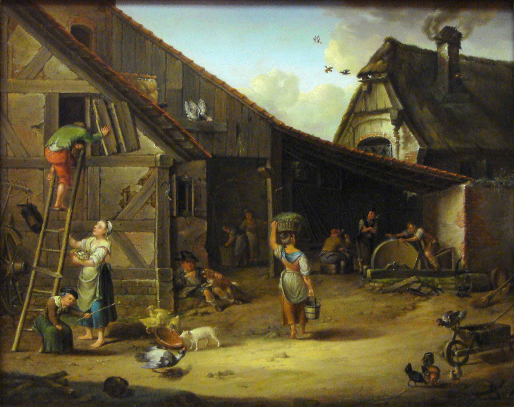
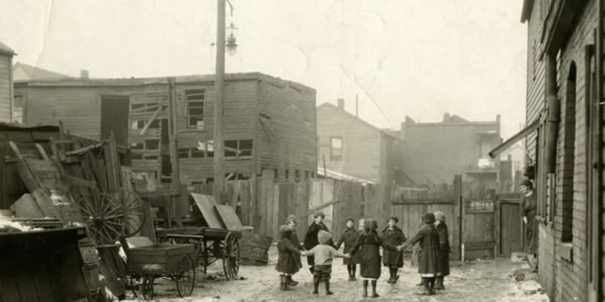

# Industry 4.0

## Question

- Place yourself in 1759.
- You are in Canada.
- As an individual, what jobs are available to you?
- Which career path would you choose?

{fig-align="center"}

## The First Industrial Revolution

[The Industrial Revolution (18-19th Century)](https://www.youtube.com/watch?v=xLhNP0qp38Q)

## The First Industrial Revolution

1. Mechanization of Production 
    – Introduction of machines to replace human and animal labor, significantly increasing productivity.
2. Steam Power 
    – The development of the steam engine revolutionized transportation and manufacturing.
3. Factory System 
    – Large-scale production in **centralized** factories replaced cottage industries and small workshops.

## The First Industrial Revolution

4. Textile Industry Boom 
    – The invention of machines like the spinning jenny and power loom transformed textile manufacturing.
5. Iron and Coal Production 
    – Growth in ironworks and coal mining provided the raw materials for machinery and transportation.
6. Railroads and Canals 
    – Improved transportation networks enabled faster movement of goods and people.

## Impact on Society

1. Urbanization 
    – People moved to cities for factory jobs, leading to rapid urban growth.
2. Rise of the Working Class 
    – A new class of industrial workers emerged, often working in harsh conditions.
3. Improved Transportation 
    – Railways and steamships facilitated faster trade and mobility.
4. Increased Production and Trade 
    – Widespread availability of goods improved standards of living for some.
5. Environmental Effects 
    – Increased pollution and deforestation due to industrial activity.

## Question

- It is 1890.
- The Industrial Revolution has just happened.
- How would you transition from your current job to a new one.
- Which career path would you take?

{fig-align="center"}

## The Second Industrial Revolution

[The Second Industrial Revolution](https://www.youtube.com/watch?v=aLvJ8p9KIH8)

## The Second Industrial Revolution

1. Mass Production & Assembly Line

    - Standardized manufacturing processes made products cheaper and more widely available.
    - Henry Ford’s assembly line (1913) revolutionized automobile production, reducing costs and time.

2. Widespread Electrification

    - Electricity replaced steam as the primary power source, leading to new industries and consumer products.
    - Enabled efficient lighting, factory machinery, and communication systems.

## The Second Industrial Revolution

3. Innovation in Steel Production

    - The Bessemer Process (1856) allowed for mass manufacturing of steel, boosting construction and infrastructure.
    - Led to skyscrapers, bridges, and modern railroads.

4. Advances in Chemical Industry

    - Large-scale production of chemicals, including fertilizers, plastics, and synthetic dyes.
    - Paved the way for modern medicine, explosives, and consumer goods.

## The Second Industrial Revolution

5. Revolution in Transportation & Communication

    - Automobiles & Airplanes
        - Karl Benz (1885) and the Wright Brothers (1903) transformed personal and commercial travel.
    - Telegraph & Telephone
        - Samuel Morse (telegraph, 1830s) and Alexander Graham Bell (telephone, 1876) accelerated global communication.

## The Second Industrial Revolution

- Key inventions
    1. Electric Light Bulb 
        – Thomas Edison (1879) enabled **night-time work** and extended productivity.
    2. Internal Combustion Engine 
        – Powered automobiles and transformed transportation.
    3. Radio Waves 
        – Guglielmo Marconi transmitted the first wireless communication (1895).
    4. Automobile Production Line – 
        Henry Ford’s innovation made cars affordable for the masses.

## Impact on Society

1. Urban Growth & Megacities 
    – Expansion of cities, improved sanitation, and the rise of skyscrapers.
2. Rise of Consumer Culture 
    – Increased production led to greater product variety and advertising growth.
3. New Job Opportunities 
    – The rise of industrial corporations required a larger workforce, including in business management.

## Impact on Society

4. Improved Living Standards 
    – Advancements in medicine, sanitation, and food production extended life expectancy.
5. Worker Exploitation and Inequality 
    – Long hours, low wages, and unsafe working conditions sparked labor movements.
6. Environmental Consequences 
    – Increased pollution from coal, steel, and chemical industries.

## Questions 

- It is 1932.
- How is your job impacted now?
- In what aspects has it improved?
- In what aspects has it worsened?

{fig-align="center"}

## The Third Industrial Revolution (Digital Revolution)

- The First Industrial Revolution (1760-1840) introduced steam-powered machines and mechanization.
- The Second Industrial Revolution (1870-1914) advanced with electricity, mass production, and telecommunications.
- The Third Industrial Revolution (1960s-Present) leverages digital computing, automation, and the internet to transform industries.

## The Third Industrial Revolution (Digital Revolution)

1. Digital Computing & Microprocessors

    - The invention of the transistor (1947) and microprocessor (1971) enabled the development of personal computers and digital devices.

2. Automation & Robotics

    - Industries began integrating robots and automated systems for manufacturing, reducing human labor while increasing efficiency.

3. The Internet & Connectivity

    - The invention of the internet (1969, ARPANET) and World Wide Web (1990, Tim Berners-Lee) transformed how businesses and people interact.

## The Third Industrial Revolution (Digital Revolution)

4. Renewable Energy

    - Shift from fossil fuels to sustainable energy sources, such as solar and wind power.

5. Big Data and AI Advancements

    - Growth in data collection, cloud computing, and artificial intelligence allows for smarter decision-making and automation.

## Key Innovations

- Innovation replaces invention

1. Personal Computers (1970s-1980s) 
    – Enabled businesses and individuals access to computers (democratization).

2. The Internet (1990s-Present) 
    – Changed communication, commerce, and social interactions globally.

## Key Innovations

3. Mobile Technology (2000s-Present) 
    – Smartphones and wireless networks revolutionized accessibility.
4. E-Commerce (1990s-Present) 
    – Platforms like Amazon and Alibaba transformed global trade.
5. Artificial Intelligence & Machine Learning (2010s-Present) 
    – Automation of decision-making and business processes.

## Question

- It is 2006.
- How would your job adapt to the Third Industrial Revolution.

{fig-align="center"}

## The Fourth Industrial Revolution (Industry 4.0)

[The Fourth Industrial Revolution - WEF](https://www.youtube.com/watch?v=SCGV1tNBoeU)

## The Fourth Industrial Revolution (Industry 4.0)

1. Artificial Intelligence (AI) & Machine Learning

    - Examples: Chatbots, self-learning algorithms, recommendation systems (Netflix, Amazon).

2. Internet of Things (IoT) & Cyber-Physical Systems

    - Example: Smart factories where machines self-diagnose issues and optimize operations.

3. Big Data & Cloud Computing

    - Example: Real-time supply chain optimization by companies like Amazon.

## The Fourth Industrial Revolution (Industry 4.0)

4. Blockchain & Decentralized Technologies

    - Example: Cryptocurrencies (Bitcoin), supply chain tracking.

5. Advanced Robotics & Automation

    - Example: Automated warehouse robots in e-commerce fulfillment.

6. Biotechnology, 3D Printing & Human-Machine Integration

    - Example: 3D-printed organs and AI-assisted drug discovery.

7. Quantum Computing & 5G Networks

    - Example: AI-powered medical diagnostics using quantum-enhanced computing power.

## The Fourth Industrial Revolution (Industry 4.0)

[What will the future of jobs be like? - WEF](https://www.youtube.com/watch?v=eH1fFdjzJAw)

## Impact on Society and Business

1. Hyper-Personalized Products & Services   
    – AI enables better customization.
2. Smart Cities & Digital Governance    
    – Urban management improves with IoT-enabled infrastructure.
3. Increased Productivity & Efficiency 
    – AI and automation reduce waste and costs.
4. New Business Models 
    – Growth of platform economies (Uber, Airbnb) and subscription-based services (Netflix, SaaS).

## Impact on Society and Business

5. Job Disruption & Reskilling Needs 
    – AI and automation may replace millions of jobs.
6. Cybersecurity & Privacy Concerns 
    – Increased reliance on digital tech poses risks of cyberattacks.
7. Ethical Challenges 
    – AI bias, surveillance, and job displacement concerns.

## Impact on Society and Business

[Ready for Brain Transparency? - WEF](https://www.youtube.com/watch?v=hfqD5aW0X5U)

